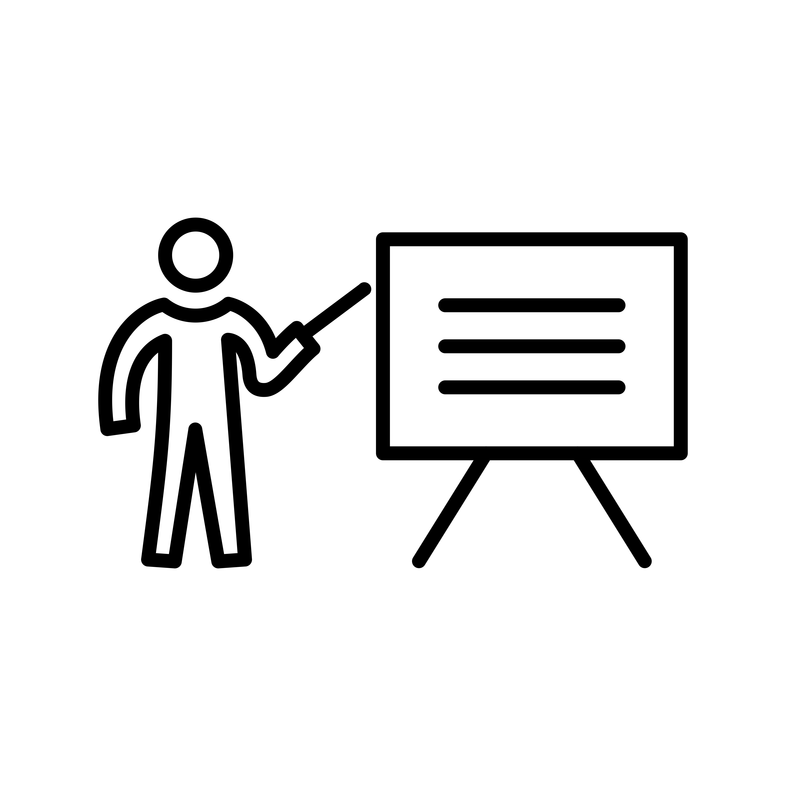

::: {.callout-tip}
### About
**Purpose:**   
Familiarise participants with the Swedish legal and institutional context in which Open Science operates. 

**Learning outcomes:**   
Upon completion of this assignment, participants will be able to:

- Describe the roles of national authorities, universities, and oversight bodies, and understand how these influence the structure and conduct of PhD studies
- articulate how academic freedom, the principle of public access (*allmän handling*), and the teacher’s exemption (*lärarundantaget*) affect transparency, data sharing, and ownership of research outputs.

**Estimated duration:**   
1.5h

**To-do:**   
Read the content below, answer the reflection questions in the [Google form](https://docs.google.com/forms/d/e/1FAIpQLSeL9FVqZh-cmhYqeutL1VlcTa5IFY9Mwc78WYweexVBVBmRbw/viewform?usp=dialog) and submit.
:::

## Introduction
Welcome to *Open Science in the Swedish Context*! In this course, we explore what Open Science is, why it is becoming a policy priority in Sweden, and how it is implemented across the Swedish research system, from government and funders to universities and individual researchers.   
Throughout the course, the focus is on **you as a PhD student**. Open Science increasingly shapes how research is planned, conducted, and communicated, and you will examine what this means in practice for your own project. We will clarify who is responsible for what, what expectations apply to you, and what support structures are available.  
The course combines an overview of the Swedish landscape with practical tools and discussion-based exercises, helping you translate Open Science principles into concrete actions in your research.

## The Swedish academic system 
Before diving into Open Science, it is essential to first understand how the Swedish research system actually works. This provides the context for how the push for Open Science is coordinated and how it shapes expectations for your research practice. Who sets the overall direction of research in Sweden? Who decides which areas are prioritised? Which aspects of your research and doctoral education are regulated at the national level, and which are determined by your university?   
Understanding the answers to these questions is key to knowing what you as a researcher in Sweden **can, must, and cannot do** with regard to Open Science, often in ways that aren’t immediately visible in your day-to-day work. A basic grasp of how the system is organised will make it easier to understand later discussions about data sharing, open access publishing, research infrastructures, and other Open Science practices.

<h3>
  
  Who sets the rules?
</h3>
First, it’s useful to understand how PhD education and research are governed at the national level. In Sweden, the [Government and the Riksdag (the Swedish parliament)](https://www.regeringen.se/other-languages/english---how-sweden-is-governed/) are responsible for higher education and research. Even if you rarely interact with them directly, their decisions shape many aspects of your PhD life, from what degrees universities can award, to how research is funded, to which rules apply to your research practice.  

The government and parliament shape PhD education and research direction in three main ways (click to expand and find out more):

***They set the legal framework for universities***

The basic rules for higher education and research in Sweden are laid down in national legislation, primarily through two laws (1):

- [The Higher Education Act](https://www.riksdagen.se/sv/dokument-och-lagar/dokument/svensk-forfattningssamling/hogskolelag-19921434_sfs-1992-1434/), which defines the overall mission of higher education, academic freedom, and the responsibilities of universities 
- [The Higher Education Ordinance](https://www.riksdagen.se/sv/dokument-och-lagar/dokument/svensk-forfattningssamling/hogskoleforordning-1993100_sfs-1993-100/), which contains more detailed provisions on degrees, admissions, employment, and study programmes 

::: {.callout}
<strong>PhD takeaway:</strong> These laws define the formal boundaries of your PhD work, from your right to academic freedom, to how your education is structured, assessed, and governed. Many everyday decisions (course requirements, supervision, examination, employment conditions) ultimately trace back to this legislation. 

:::

The Government also sets the medium-term strategic direction for Swedish research through a national research policy bill published every four years. [The current bill (2025–2028)](https://www.regeringen.se/rattsliga-dokument/proposition/2024/12/prop.-20242560) highlights priorities such as research excellence, internationalisation, innovation, and openness and influences how public research funding is distributed. 

::: {.callout}
<strong>PhD takeaway:</strong> National research priorities influence what kind of research is funded and encouraged. Open Science has been explicitly highlighted in research policy bills since 2016, which is why expectations around data sharing, publications, and transparency increasingly shape PhD projects. 

:::

***They allocate public funding to universities***

Public funding is the main way the government supports research and PhD education in Sweden. How much money is available, who it goes to, and the conditions attached to it help shape what research is possible, what projects get prioritized, and the expectations around Open Science.
Research and PhD education in Sweden is funded separately from undergraduate and master’s education, and funding comes from several sources (2):

- **Recurrent government funding**   
Non-competitive base grants allocated directly to universities, which provide long-term stability for research and PhD education.

- **External competitive funding**  
Awarded by public agencies as well as private research funders and organisations.   
  Almost half of this funding comes from the Swedish government through national research funders, including:  
   - the Swedish Research Council ([Vetenskapsrådet](https://www.vr.se))
   - the Swedish Research Council for Health, Working Life and Welfare ([Forte](https://forte.se/en))
   - the Swedish Research Council for Sustainable Development ([Formas](https://formas.se/en/start-page.html))
   - Sweden’s Innovation Agency ([Vinnova](https://www.vinnova.se/en/))
   - the Swedish Energy Agency ([Energimyndigheten](https://www.(energimyndigheten.se/en/))) 
     
    Around 35% of external competitive funding comes from research foundations and private non-profit organisations, such as the [Knut and Alice Wallenberg Foundation](https://kaw.wallenberg.org/en) and  [The Swedish Foundation for Strategic Research](https://strategiska.se/en/call-for-proposals/).  
    The remaining 20% of external competitive funding comes from private companies, EU funding schemes (e.g. The EU Framework Programme for Research and Innovation, currently [Horizon Europe](https://research-and-innovation.ec.europa.eu/funding/funding-opportunities/funding-programmes-and-open-calls/horizon-europe_en)), and other funding streams.   

::: {.callout}
<strong>PhD takeaway:</strong> How your research is funded matters. Funding sources can shape project timelines, reporting requirements, data management plans, and expectations around open access and data sharing. Understanding who funds your work helps you anticipate these requirements early, rather than discovering them (too) late in the project.

:::

***They supervise higher education and research providers to ensure compliance with national legislation***

To make sure universities follow the rules, several independent government agencies under the [Ministry of Education and Research](https://www.government.se/government-of-sweden/ministry-of-education-and-research/) oversee higher education and research activities in Sweden.  

- The Swedish Higher Education Authority ([Universitetskanslersämbetet, UKÄ](https://www.uka.se/swedish-higher-education-authority/)) supervises universities’ compliance with the Higher Education Act and Ordinance. It is responsible for:
  - quality assurance of higher education
  - appraisal of degree-awarding powers
  - legal supervision of universities 
  - statistics, monitoring, and long-term analysis of the higher education sector
- The Swedish Council for Higher Education ([Universitets- och högskolerådet, UHR](https://www.uhr.se/en/start/about-the-council/)) focuses on admissions, recognition of qualifications, international mobility, and information about higher education.

::: {.callout}
<strong>PhD takeaway:</strong> You rarely interact with these agencies directly, but they shape the framework around your PhD, including degree standards, quality assurance, and institutional responsibilities. When disputes, delays, or formal issues arise, these bodies define what universities are required to provide and uphold.

:::

Taken together, national laws, funding rules, and oversight bodies set the broad framework for how Swedish academia works. At this level, priorities for Open Science are established and shape the funding and support available for putting it into practice. For you as a PhD student, this means that expectations around openness (e.g. open access publishing, data management, transparency, and research integrity) aren’t just local preferences at your university, but  increasingly backed by national policies and laws. 

<h3>
  
  What do universities decide?
</h3>

Although Sweden’s higher education system is nationally regulated, universities are given a lot of freedom in how research and education is carried out. The Government sets overarching goals, which means that all Swedish universities share a common mission that includes:

- Education based on research or artistic practice
- Research and development work
- Interaction with society, so that research and knowledge benefit the wider community

How universities specifically fulfil this mission is however largely up to them. Within the national legal framework, universities can independently decide:

- How they are organised
- Which courses and programmes to offer
- How education is designed and delivered
- How many students to admit
- What research to prioritise

There is thus no nationally fixed curriculum and no central planning of how much research or education should be done in specific fields. This institutional autonomy is a defining characteristic of the Swedish system.

::: {.callout}
<strong>PhD takeaway:</strong> Your everyday PhD experience (e.g. supervision structures, course offerings, research culture, expectations, and support) is shaped primarily by your university, not by the national system. This is why PhD conditions can differ significantly between institutions, even within the same discipline.

:::

Because the national framework deliberately leaves room for interpretation, universities have a lot of responsibility for turning expectations about openness into practice. This is where Open Science becomes concrete: through local policies, support services, infrastructure, training, and everyday routines. For you as a PhD student, knowing what comes from national requirements and what is decided by your university helps you see what you *have* to do, what you can adapt, and where to ask for help as Open Science becomes part of your research work.

## Openness built into the Swedish academic system
Between national policy and university-level decision-making, there are some core principles in Swedish academia that apply to ***all*** Swedish universities. These rules are the same everywhere and are **not optional**, they are built into law and long-standing academic practice. Even though they are not labelled as “Open Science”, they set clear expectations around transparency, access, and responsibility in research. For you, this means there is a shared baseline for how research in Sweden should be carried out, documented, and shared, regardless of where you are enrolled.

<h3>
  
  Academic freedom
</h3> 
The first foundational principle is ***academic freedom***, which is protected in the Higher Education Act. In Sweden, universities are legally required to safeguard academic freedom as a core condition for research and education. In practice, this means that all researchers — including you as a PhD student — have the right to:

- choose and refine their research questions
- develop and apply appropriate methods
- communicate, publish, and discuss their results

Universities have to not only respect your academic freedom, but also actively protect and promote it by providing appropriate working conditions, supervision, and safeguards.
At the same time, academic freedom is not unlimited. It comes with clear responsibilities. The Higher Education Act emphasises academic integrity and good research practice, meaning that you are expected to conduct your research ethically, transparently, and responsibly. To better understand the ethical principles, regulations, and responsibilities that apply to your research, see [Good Research Practice 2024](https://www.vr.se/english/analysis/reports/our-reports/2025-07-03-good-research-practice-2024.html), a report published by the Swedish Research Council.

::: {.callout}
<strong>PhD takeaway:</strong> Academic freedom gives you room to shape your research and how you communicate it, but it also means you are responsible for following good research practice, documenting your work properly, and engaging honestly with the research community.
:::

<h3>
  
  The principle of public access ('Allmän handling') 
</h3> 

The second foundational principle is ***transparency in research***. In Sweden, this is not only a scientific ideal but a legal requirement. Under the [Freedom of the Press Ordinance](https://www.riksdagen.se/sv/dokument-och-lagar/dokument/svensk-forfattningssamling/tryckfrihetsforordning-1949105_sfs-1949-105/) (Tryckfrihetsförordningen, 1949:105), the public ("allmänheten") has a constitutional right to access ***allmänna handlingar (official public documents)*** held by public authorities. Because public universities are classified as public authorities, many documents created or held within universities fall under this principle.

In practice, this means:

- **A wide range of material connected to your PhD work may be considered public**, e.g. meeting minutes, project documentation (i.e. lab journal), email correspondence, research protocols, and in some cases databases or research records **can be requested by anyone**. 
- **A person requesting access does not need to explain why**, and they may remain anonymous. 
- **If a university refuses to release a document, the decision must be legally justified** and can be challenged in the Court of Appeal (‘Hovrätt’). 

Transparency also applies over time. Under the [Archives Act](https://www.riksdagen.se/sv/dokument-och-lagar/dokument/svensk-forfattningssamling/arkivlag-1990782_sfs-1990-782/) (Arkivlagen, 1990:782), public authorities (including universities) are required to preserve and manage your research documentation for legal, scientific, and historical purposes. This means that research records connected to your PhD may not only be accessible during your studies, but may also be stored and retrievable long after your project has ended.

As seen above, public access is **not unlimited** and universities *can* refuse to release a document. The [Public Access and Secrecy Act](https://www.riksdagen.se/sv/dokument-och-lagar/dokument/svensk-forfattningssamling/offentlighets-och-sekretesslag-2009400_sfs-2009-400/) (Offentlighets- och sekretesslagen, 2009:400) defines what information must be kept confidential, for example to ensure:

- Confidentiality: Protecting personal data and sensitive research topics
- Legal compliance: Following ethical guidelines and applicable laws
- Risk mitigation: Balancing transparency with security

Ethical approvals, data protection legislation (GDPR), and secrecy rules can therefore restrict what may be disclosed, even if a document does exist.

From an Open Science perspective, the principle of public access sets **transparency as the default** in publicly funded research in Sweden. Openness is assumed unless there are clear legal or ethical reasons not to share. This is why careful documentation, traceability, and responsible data management are central to Swedish research governance and Open Science, and why these practices matter directly in your everyday PhD work.

::: {.callout}
<strong>PhD takeaway:</strong> Research notes, emails, reports, and datasets connected to your work may be subject to public access requests. This makes careful documentation, data management, and awareness of legal protections especially important.
:::

<h3>
  
  The teacher's exemption ('Lärarundantaget') 
</h3> 
The third foundational legal principle that is applied in Swedish academia is the ***lärarundantaget (teacher’s exemption)***. Unlike in many other countries, this means that **teachers and researchers (including PhD students) generally retain the rights to materials they create in the course of their academic work**, rather than these rights automatically transferring to the university as the employer. This give you a comparatively strong position when it comes to ownership of your academic work!

For PhD students, *lärarundantaget* primarily affects intellectual property, such as novel methods, software, algorithms, materials, or therapeutics. If your PhD project develops any of these, you typically have significant influence over how your work is used, shared, or further developed, including whether, when, and how it is made openly available. Some data and materials in projects involving intellectual property might be legitimately exempt from open access requirements, including:

- Data protected under intellectual property laws, such as [Patent Law (1967:837)](https://www.riksdagen.se/sv/dokument-och-lagar/dokument/svensk-forfattningssamling/patentlag-1967837_sfs-1967-837/), where early openness could conflict with innovation, commercialisation, or patentability.  
- Data that is owned by third parties and protected by [Copyright Law (1960:729)](https://www.riksdagen.se/sv/dokument-och-lagar/dokument/svensk-forfattningssamling/lag-1960729-om-upphovsratt-till-litterara-och_sfs-1960-729/) that limits redistribution or reuse.

From an Open Science perspective, *lärarundantaget* can be seen as a double-edged sword. On one hand, retaining rights to your own work gives you the freedom to share materials, add licences that support openness and reuse, and contribute to a transparent research culture. On the other hand, not all outputs can or should be shared immediately. If your work involves innovation, methods, or data that could be patented or are subject to commercial or third-party rights, immediate openness may conflict with patentability, licensing agreements, or intellectual property protections.  
  
This means that as a PhD student, you carry the responsibility to make informed decisions about what, when, and how to share your work. Understanding these boundaries early helps you balance openness with ethical, legal, and strategic considerations, ensuring that your research is both responsible and maximally reusable whenever possible.

::: {.callout}
<strong>PhD takeaway:</strong> <em>Lärarundantaget</em> gives you the flexibility to support Open Science by retaining the rights to your work, but it also means you must actively consider legal, ethical, and contractual limits when sharing data, code, or results during your PhD.
:::

## Reflection questions
In this assignment, we’ve explored how the Swedish academic system works and discussed three key principles that embed a baseline level of openness in Swedish research: academic freedom, allmänna handlingar, and lärarundantaget.  
  
Now, it’s time to reflect on what this governance structure and openness means for your own project. Consider how the Swedish rules and principles discussed in this assignment shape the way you document, share, and manage your research, and how they interact with your responsibilities as a PhD student. 
  
To complete the assignment, fill out the reflection questions in the form below that guide you to think critically about your practices, anticipate potential challenges, and prepare for discussions during the course.

<iframe src="https://docs.google.com/forms/d/e/1FAIpQLSeL9FVqZh-cmhYqeutL1VlcTa5IFY9Mwc78WYweexVBVBmRbw/viewform?embedded=true" width="640" height="2382" frameborder="0" marginheight="0" marginwidth="0">Loading…</iframe>

**Well done on completing the assignment! You can now move on to '[*Assignment 2: OS in Sweden: what, why, how and who?*](Assignment2.qmd)' to learn more about Open Science!** 
  

## References and further reading
(1) Swedish Higher Education Authority. (2023) *Governance of higher education* **Swedish Higher Education Authority** https://www.uka.se/swedish-higher-education-authority/about-higher-education/governance-of-higher-education. Accessed 11-02-2025
(2) Ahlstedt, S., Doctrinal, L., Gribbe, J., Hansson, A. & Stengård, E. (2025) *Sweden’s academic landscape: Higher education and research explained* **Swedish Higher Education Authority** Report 2025:18.  
  
Bird cage icon: <a target="_blank" href="https://icons8.com/icon/AhRnLEUXZTTN/freedom">Freedom</a> icon by <a target="_blank" href="https://icons8.com">Icons8</a>.   
Teacher icon: <a href="https://www.vecteezy.com/free-vector/teach-icon">Teach Icon Vectors by Vecteezy</a>.  
Document icon: Icon by <a href='https://www.iconpacks.net/?utm_source=link-attribution&utm_content=901'>Iconpacks</a>.   
  
[1949:105 The Freedom of the Press Ordinance](https://www.riksdagen.se/sv/dokument-och-lagar/dokument/svensk-forfattningssamling/tryckfrihetsforordning-1949105_sfs-1949-105/), ‘Tryckfrihetsförordning’, Justitiedepartementet, 1949.    
[1960:729 on Copyright in Literary and Artistic Works](https://www.riksdagen.se/sv/dokument-och-lagar/dokument/svensk-forfattningssamling/lag-1960729-om-upphovsratt-till-litterara-och_sfs-1960-729/), 'Om upphovsrätt till litterära och konstnärliga verk', Justitiedepartementet, 1960.   
[1967:837 Patent law](https://www.riksdagen.se/sv/dokument-och-lagar/dokument/svensk-forfattningssamling/patentlag-1967837_sfs-1967-837/), 'Patentlag', Justitiedepartementet, 1967.   
[1990:782 Archives Act](https://www.riksdagen.se/sv/dokument-och-lagar/dokument/svensk-forfattningssamling/arkivlag-1990782_sfs-1990-782/), 'Arkivlag', Kulturdepartementet, 1990.    
[1992:1434 The Higher Education Act](https://www.riksdagen.se/sv/dokument-och-lagar/dokument/svensk-forfattningssamling/hogskolelag-19921434_sfs-1992-1434/), 'Högskolelag', Utbildningsdepartement, 1992.     
[1993:100 Higher Education Ordinance](https://www.riksdagen.se/sv/dokument-och-lagar/dokument/svensk-forfattningssamling/hogskoleforordning-1993100_sfs-1993-100/), 'Högskoleförordning', Utbildningsdepartement, 1993.   
[2009:400 Public Access and Secrecy Act](https://www.riksdagen.se/sv/dokument-och-lagar/dokument/svensk-forfattningssamling/offentlighets-och-sekretesslag-2009400_sfs-2009-400/), ‘Offentlighets- och sekretesslag’, Justitiedepartementet, 2009.   
[2019:504 the Act on Responsibility for Good Research Practice and the Examination of Research Misconduct](https://www.riksdagen.se/sv/dokument-och-lagar/dokument/svensk-forfattningssamling/lag-2019504-om-ansvar-for-god-forskningssed-och_sfs-2019-504/), 'Om ansvar för god forskningssed och prövning av oredlighet i forskning', Utbildningsdepartement, 2019.   
[2022:818 On the Public Sector's Access to Data ](https://www.riksdagen.se/sv/dokument-och-lagar/dokument/svensk-forfattningssamling/lag-2022818-om-den-offentliga-sektorns_sfs-2022-818/), 'Om den offentliga sektorns tillgängliggörande av data', Finansdepartementet, 2022.   
[EU 2016/679 Data Protection Regulation (GDPR)](https://eur-lex.europa.eu/eli/reg/2016/679/oj/eng), European Union, 2016.   
[Good Research Practice](https://www.vr.se/uppdrag/etik/god-forskningssed---ny-utgava.html). 'God forskningssed', VR, 2024.    
[Guidance for higher education institutions' work to prevent, manage and follow up on suspected deviations from good research practice](https://suhf.se/app/uploads/2023/09/.   REK-2020-3-REV-Vagledning-for-larosatens-arbete-med-att-forebygga-hantera-och-folja-upp-misstankar-om-avvikelser-fran-god-forskningssed-REVIDERAD-2023.pdf). 'Vägledning för lärosätens arbete med att förebygga, hantera och följa upp misstankar om avvikelser från god forskningssed', SUHF, 2023    

