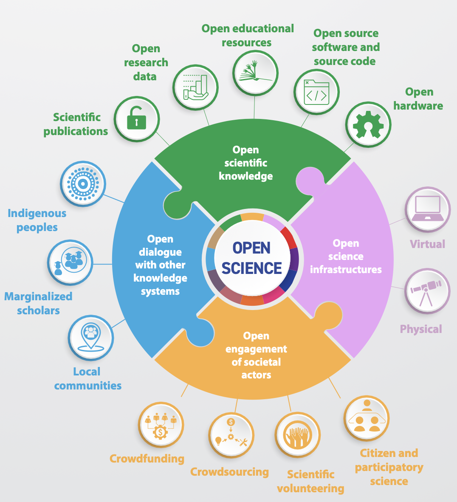
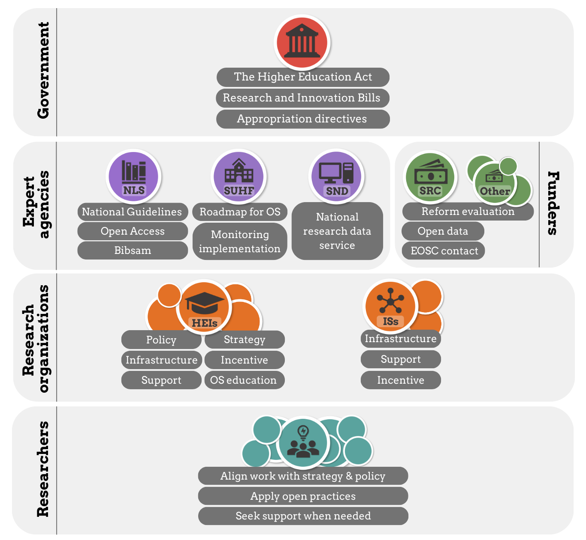

::: {.callout-tip}
### About
**Purpose:**   
To develop an understanding of how responsibilities for Open Science are distributed across different actors in the Swedish research system, and to prepare participants for discussion-based sessions during the in-person training. 

**Learning outcomes:**   
Upon completion of this assignment, participants will be able to:

- Identify the main institutions that govern Swedish research and higher education.
- Describe the roles and responsibilities of researchers, universities, and funders in the Swedish system.
- Explain the implications of Lärarundantaget (teacher’s exemption) on academic work. Understand the principle of public access to official documents (Allmän handling) and how it affects research.

**Estimated duration:**   
120min

**To-do:**   

:::

<!-- 
## Introduction
In Assignment 1, you examined how the Swedish academic system is organised, including which decisions are taken at the governmental level and which responsibilities rest with universities. You also discovered some foundational principles that embed elements of openness within the higher education and research system in Sweden.  
In this assignment, we move from structure to implementation. We take a closer look at Open Science: what it entails, what ambitions and promises are associated with it, how it is operationalised within the Swedish research system, and how responsibilities are distributed among different actors. Most importantly, you will reflect on what these expectations mean in practice for you as a PhD student.
 
To complete this assignment, read the chapters below and prepare the group-work task. The results will be presented and discussed during the in-person workshop at the DDLS Research School Retreat on March 19th.

## Open Science: what is it?  
Open Science is a broad transformation of how research is **conducted, documented, shared, and evaluated**.  Over the past decade, it has moved from being a grassroots movement advocating for openness to becoming a formal policy framework adopted by governments, funders, and universities worldwide. 

In 2021, UNESCO adopted the first internationally agreed definition of Open Science in its [Recommendation on Open Science](https://www.unesco.org/en/open-science/about?hub=686) (2021). It defines Open Science as: 

::: {.callout}
<strong>An  inclusive  construct  that  combines  various movements and practices, aiming to:</strong> 

- Make multilingual scientific knowledge openly available, accessible and reusable for everyone
- Increase scientific collaborations and sharing of information for the benefits  of science and society
- Open the processes of scientific knowledge creation, evaluation and communication to actors beyond the traditional scientific community
  
All scientific disciplines and all aspects of scholarly practice are included.

:::

UNESCO structures Open Science around four interconnected pillars:

{ width=50% fig-align="left"}

::: {.callout}
<strong>1. Open scientific knowledge:</strong> 
This refers to free access to research publications, research data, educational resources, software, source code, and even hardware. The emphasis is not only on access, but on reuse through open licenses and formats that allow others to build upon your work.

**PhD takeaway:** You are expected to make your research outputs as open as possible: publish open access when feasible, manage and document your data so others can understand and reuse it, share code and workflows where appropriate, and apply FAIR principles from the start of your project.

:::

::: {.callout}
<strong>2. Open science infrastructures:</strong> 
Openness requires infrastructure. Repositories, data services, persistent identifiers, high-performance computing environments, and metadata standards are all part of the ecosystem that makes Open Science possible.

**PhD takeaway:** You are not expected to build infrastructure, but you are expected to use it. This includes depositing publications in repositories, writing data management plans, using persistent identifiers (e.g. ORCID), and following institutional and funder guidelines for storage and sharing.

:::

::: {.callout}
<strong>3. Open engagement of societal actors:</strong> 
This pillar promotes transparency in the research process and encourages engagement beyond academia — for example through citizen science, public dialogue, or collaboration with policy-makers and industry.

**PhD takeaway:** Depending on your field, you may be expected to communicate your research beyond academia, through public talks, policy briefs, collaboration with external partners, or accessible summaries. Open Science encourages you to consider who might benefit from your research and how they can access or engage with it.

:::

::: {.callout}
<strong>4. Open dialogue with other knowledge systems:</strong> 
This pillar promotes respectful dialogue between academic research and other forms of knowledge — including Indigenous knowledge systems, practitioner expertise, and community-based knowledge.

**PhD takeaway:** Open Science asks you to reflect on whose knowledge counts. In practice, this may involve ethical collaboration with communities, recognition of non-academic expertise, or sensitivity to cultural and societal contexts when conducting and communicating research.

:::

At its core, Open Science is about shifting research from being **closed by default** to being **open by design**. Instead of publishing results behind paywalls, storing data on personal hard drives, or treating methods as implicit know-how, Open Science encourages you as a researcher to make your outputs and processes transparent, accessible, and reusable. Importantly, openness can only be applied where possible and appropriate. A key phrase in the Open Science movements is:   

### ***'As open as possible, as closed as neccesary'***
  

## Open Science: why?  
In the Swedish context, Open Science is closely linked to broader national ambitions: strengthening research quality, improving efficiency in the use of public funding, increasing societal relevance, and maintaining international competitiveness. These ambitions mirror developments across the EU and OECD, where openness is framed as both a quality-enhancing and democratising reform of research systems.
The overarching promise of Open Science is that greater transparency and accessibility improve how knowledge is produced and used. In policy discourse, increased openness is expected to contribute to:
Higher research quality and reproducibility
Faster dissemination and uptake of results
Increased societal impact and innovation
More equitable access to publicly funded research
The logic is straightforward: when publications, data, and methods are openly available, research can be scrutinised, validated, replicated, and reused. Barriers to access are lowered, duplication of effort may be reduced, and collaboration across disciplines and sectors becomes easier.
However, the empirical evidence is uneven across different components of Open Science. For example:
Open access publishing is relatively well studied, with substantial evidence showing increased visibility and citation advantage in many fields (though the magnitude varies).
Data sharing has documented benefits for reuse and citation, but uptake remains inconsistent and discipline-dependent.
Open methods and reproducibility practices are widely promoted as improving robustness, yet implementation challenges and incentive misalignments persist.
Societal engagement and impact pathways are conceptually compelling, but causal links between openness and measurable societal outcomes are harder to demonstrate systematically.
In other words, Open Science carries strong normative and policy expectations, and there is growing empirical support for several of its components — but its full systemic impact is still evolving and remains the subject of ongoing research and debate.
This tension between promise and practice is important to keep in mind as we move to the Swedish implementation context.

## Open Science: how and who?
Open Science introduces new responsibilities at multiple levels of the research system. It is therefore not solely an individual commitment but a shared systemic effort.

Open Science in Sweden involves coordinated action across several actors, each with distinct mandates and responsibilities.

{ width=70% fig-align="left"}

1. National Government
Sets overarching research and Open Science policy objectives through research bills and national strategies.
2. National Agencies
Several agencies have specific mandates connected to Open Science, including:
The National Library of Sweden (KB) – coordinates and develops national guidelines for Open Science.
Swedish Research Council (VR) and other research funders – implement Open Science requirements through funding conditions.
SND (Swedish National Data Service) – supports data management and sharing.
Other national research infrastructures and coordinating bodies.
3. Research Funders
Funders operationalize Open Science through grant requirements, such as:
Open access publishing mandates
Data management plan requirements
Data sharing expectations
Monitoring and compliance mechanisms
4. Universities
Universities are responsible for:
Providing infrastructure and support (repositories, data stewards, libraries)
Developing institutional policies
Supporting researchers in compliance
Ensuring research quality and integrity
5. Individual Researchers
Researchers — including PhD students — are responsible for implementing Open Science in their daily practice:
Publishing open access when required
Managing and sharing data responsibly
Applying transparent methods
Engaging ethically with societal stakeholders
Open Science is therefore distributed across levels. It cannot be implemented by researchers alone, nor solely by institutions.

## Assignment

You will be divided into groups of 5–6 participants before the course. Each group will be assigned one of the six Open Science areas listed above.
Preparation
Each group should:
Read the relevant section in the National Library of Sweden’s national guidelines.
Pay particular attention to the section titled “Actors and their areas of responsibility.”
Task
Prepare a two-slide summary addressing the following:
What does Open Science mean in practice within your assigned area?
Move beyond definitions. Describe what concrete actions or changes are implied.
What is expected of:
The individual researcher?
The university?
Funders or research infrastructures?
From a PhD student perspective:
Which expectation in this area seems most realistic?
Which seems least realistic?
Why?
Be specific. Consider structural constraints (time, funding, supervision, disciplinary norms) as well as enabling factors (institutional support, infrastructure, funder mandates).

Areas of Open Science in Sweden
The National Library of Sweden’s national guidelines structure Open Science into six areas:
Open access to scholarly publications
Open access to research data
Open research methods
Open educational resources
Public engagement in science
Infrastructures supporting Open Science
Each area contains expectations directed at different actors and clarifies how responsibilities are distributed.
Importantly, expectations differ depending on role and seniority. Some requirements fall directly on individual researchers, while others depend on institutional or national infrastructure.

Examples of key national actors
- Swedish National Data Service (SND)
A national research infrastructure that supports research data management, sharing, and long-term preservation. SND works with universities to provide guidance on data management plans, metadata, and data publication.
- SciLifeLab
A national research centre and infrastructure for data-driven life science, offering advanced technologies, platforms, and training. Many PhD students interact with SciLifeLab through infrastructure access, courses, or data-intensive research environments.
- National research infrastructures
Funded largely through the Swedish Research Council, these include facilities for high-performance computing, sequencing, imaging, and other advanced research methods. Access is often cross-institutional and governed by national rules.
- University libraries and national library collaboration
Libraries play a key role in open access publishing, research data support, bibliometrics, and compliance with funder and policy requirements. Many Open Science services are delivered locally but coordinated nationally.
- SUHF (Association of Swedish Higher Education Institutions)
A collaboration body for Swedish universities that develops joint positions, guidelines, and recommendations on issues such as Open Science, research data, and academic governance.

::: {.callout}
<strong>PhD takeaway:</strong> Much of the support you encounter during your PhD — especially around data, infrastructure, and Open Science — comes from national bodies working together with your university. Knowing who does what can help you find the right support faster and understand where requirements actually come from.
:::

  
## References and further reading
- [The ARRIVE guidelines 2.0: Updated guidelines for reporting animal research](https://arriveguidelines.org/arrive-guidelines). Percie du Sert N, Hurst V, Ahluwalia A, Alam S, Avey MT, Baker M, et al. (2020) *PLOS Biology* 18(7) 
- [CARE Principles for Indigenous Data Governance](https://www.gida-global.org/care). Global Indigenous Data Alliance, 2018
- [COPE Ethical Guidelines for Peer Reviewers](https://web.sciedu.ca/images/COPE/Ethical_Guidelines_For_Peer_Reviewers_2.pdf). COPE Council, 2017
- [the Declaration of Helsinki](https://www.wma.net/policies-post/wma-declaration-of-helsinki/). World Medical Association, 2024   
- [European Code of Conduct for Research Integrity](https://allea.org/wp-content/uploads/2023/06/European-Code-of-Conduct-Revised-Edition-2023.pdf). ALLEA, 2023   
- [Global responsible engagement: checklist](https://suhf.se/app/uploads/2023/04/SUHF-Checklist-Global-Responsible-Engagement-REC.-2023-4-230411-REVISED.pdf). the Association of Swedish Higher Education Institutions (SUHF), 2023
- [Good Research Practice](https://www.vr.se/uppdrag/etik/god-forskningssed---ny-utgava.html). 'God forskningssed', VR, 2024 
- [Guidelines on the responsible use of generative AI in research developed by the European Research Area Forum](https://research-and-innovation.ec.europa.eu/news/all-research-and-innovation-news/guidelines-responsible-use-generative-ai-research-developed-european-research-area-forum-2024-03-20_en). European Commission, 2024
- [Guidance for higher education institutions' work to prevent, manage and follow up on suspected deviations from good research practice](https://suhf.se/app/uploads/2023/09/REK-2020-3-REV-Vagledning-for-larosatens-arbete-med-att-forebygga-hantera-och-folja-upp-misstankar-om-avvikelser-fran-god-forskningssed-REVIDERAD-2023.pdf). 'Vägledning för lärosätens arbete med att förebygga, hantera och följa upp misstankar om avvikelser från god forskningssed', SUHF, 2023  
- [Handbook on Whistleblower protection in research](https://zenodo.org/records/8192478). European Network for Research Integrity Offices (ENRIO), 2023 
- [the Nagoya Protocol](https://www.cbd.int/abs/text/default.shtml). Convention on Biological Diversity, 2010   
- [PREPARE: Guidelines for planning animal research and testing)](https://norecopa.no/PREPARE). Smith, AJ, Clutton, RE, Lilley, E, Hansen KEA, Brattelid, T. (2018) *Laboratory Animals* 52(2):135-141 
- [Recommendations to higher education institutions on how to work with responsible internationalisation](https://www.stint.se/wp-content/uploads/2022/09/STINT_Ansvarsfull-internation_web.pdf). The Swedish Foundation for International Cooperation in Research and Higher Education ('Stiftelsen för internationalisering av högre utbilndning och forskning'), 2022 
- [SciLifeLabs code of conduct](https://www.scilifelab.se/code-of-conduct/). SciLifeLab Operations Office, 2023    
- [The TRUST code, a global code of conduct of equitable research partnerships](https://www.globalcodeofconduct.org/wp-content/uploads/2023/06/The_TRUST_Code.pdf). TRUST, 2018
- [User Guide - DECLARE NAGOYA IT system](https://www.naturvardsverket.se/4ac4da/contentassets/09859c1d752d445ab59f06c0544fe6e0/question-and-answer-users.pdf).  
- [The Vancouver recommendations](https://www.icmje.org/icmje-recommendations.pdf). International Committee of Medical Journal Editors (ICMJE), 2025

-->