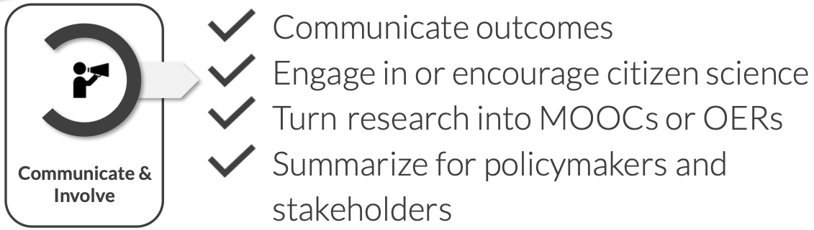
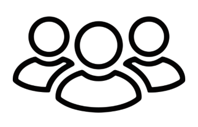
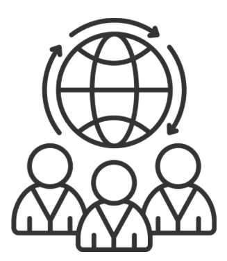

::: {.callout-tip}
### About
**Purpose:**   
To introduce participants to the communicate and involve stage of the Open Science workflow, with a focus on science communication and citizen science as practices that extend the reach and impact of research beyond academia. 

**Learning outcomes:**   
Upon completion of this assignment, participants will be able to:

- Explain the key principles of citizen science and reflect on whether and how public participation could play a role in their own research
- Describe how researchers can effectively communicate scientific work to the public and identify the support structures available to them at their institution and nationally

**Estimated duration:**   
2.5h

**To do:**  
Read the content below, complete the assignment in the [Google form](https://docs.google.com/forms/d/e/1FAIpQLSeL9FVqZh-cmhYqeutL1VlcTa5IFY9Mwc78WYweexVBVBmRbw/viewform?usp=dialog) and submit.
:::

## Introduction
This module focuses on the **communicate and involve** stage of the Open Science workflow: **sharing your research beyond the academic community and opening up the scientific process to broader participation.** 
  
This stage comes after you have collected and analysed your data, and often after you have published your results. It is based on a straightforward premise: for much of the knowledge generated through publicly funded research, there is value beyond the journal article, and you as a researcher can play a role in making that value accessible. This means thinking about who might benefit from your work and how they can meaningfully engage with it, e.g. through writing an accessible summary for a general audience, contributing to policy discussions, involving non-scientists in the research process itself, or turning your findings into educational resources that others can build on.

{ fig-align="left"  width="70%"}

These practices are increasingly part of what it means to conduct research responsibly and openly, and are becoming more visible in funding applications and career evaluations.  
  
This module introduces the main practices at the *communicate and involve* stage, with a focus on citizen science and science communication. As with other stages of the Open Science workflow, there is no single right approach, what is most relevant will depend on your research topic, your audience, and your career stage. The goal is to become familiar with what is possible, reflect on what is realistic for your own project, and identify at least one way you can extend the reach of your research beyond academia.

## The basics of science communication

Science communication is the practice of sharing scientific knowledge, methods, and findings with audiences outside the academic community. It is about making your research accessible and relevant to people who were not in the room when you ran the experiment or wrote the paper.  

Unlike in many countries where science communication is encouraged but optional, in Sweden it is a legal obligation. **The [Higher Education Act (1992:1434)](https://www.riksdagen.se/sv/dokument-och-lagar/dokument/svensk-forfattningssamling/hogskolelag-19921434_sfs-1992-1434/), establishes science communication as a core responsibility of Swedish universities alongside education and research** (see [Assignment 1](Assignment1.qmd)). In Swedish, this is also refereed to as universities' **'tredje uppgiften'** (the third mission). Universities are required to interact with the surrounding society and to ensure that knowledge and competence developed in academic settings benefit the wider community.  

<h3>
  
  Why does it matter? 
</h3> 

There are several reasons why science communication is a core responsibility of 
doing research in Sweden, the most important being the following:

**Research impact depends on reach.** A finding that stays behind a paywall or inside a journal read only by specialists has limited real-world impact, however significant it is scientifically. Research that informs policy, shapes public understanding, or reaches practitioners and decision-makers has the potential to generate change. 

**Public trust in science is not guaranteed.** Misinformation spreads quickly, and scientific institutions are not immune to public scepticism. Researchers who communicate clearly, honestly, and accessibly (including about uncertainty and limitations) contribute to a culture of evidence-based public discourse. 

**Engagement can improve the research itself.** Communicating your work to non-specialist audiences often forces a clarity of thinking that specialist writing does not demand. Engaging with the public, policymakers, or practitioners can also surface questions, perspectives, and applications that would not arise within a purely academic context, making your research more robust and more relevant.

These are the primary reasons, but there are further benefits to communicating 
your science. Whatch the video below to get a broader overview:

<iframe width="560" height="315" src="https://www.youtube.com/embed/mIT5KNtRs08?si=10pMnRPNi8ORexdP" title="YouTube video player" frameborder="0" allow="accelerometer; autoplay; clipboard-write; encrypted-media; gyroscope; picture-in-picture; web-share" referrerpolicy="strict-origin-when-cross-origin" allowfullscreen></iframe> 
<small>*Why should you bother doing science communication? | 'Talking Science' 
Course #1 — Greg Foot (2019)*</small> 

<h3>
  
  Who do you want to engage, and how? 
</h3> 

Effective science communication starts with knowing who you are trying to reach 
and choosing the right channel to reach them. The audiences for science 
communication are varied, and so are the ways you can engage with them:

::: {.callout}
<strong>Audiences</strong> 

The general public, policymakers, journalists, patient groups, industry stakeholders, civil society organisations. 
  

:::

::: {.callout}
<strong>Channels</strong> 

Media articles and press releases, social media, public lectures and festivals, exhibitions and science cafés, podcasts and video, Wikipedia, policy briefs, citizen science initiatives. 
  

:::

Different audiences require different approaches: a policy brief for a government agency looks very different from a social media post aimed at the general public, even if the underlying research is the same. The two videos below walk you through how to identify and profile your audience, and give an overview of the main types of science communication available to you.  
  
<iframe width="560" height="315" src="https://www.youtube.com/embed/4UGTizPkfrs?si=FasWXBAEfrQNK5M4" title="YouTube video player" frameborder="0" allow="accelerometer; autoplay; clipboard-write; encrypted-media; gyroscope; picture-in-picture; web-share" referrerpolicy="strict-origin-when-cross-origin" allowfullscreen></iframe>  
<small>*Who do you want to engage with your science? | 'Talking Science' 
Course #2 — Greg Foot (2019)*</small> 
  
<iframe width="560" height="315" src="https://www.youtube.com/embed/XYwg2lsrCY0?si=b6g2wIN9-ohMquWV" title="YouTube video player" frameborder="0" allow="accelerometer; autoplay; clipboard-write; encrypted-media; gyroscope; picture-in-picture; web-share" referrerpolicy="strict-origin-when-cross-origin" allowfullscreen></iframe>  
<small>*What type of science communication can you do?| 'Talking Science' 
Course #3 — Greg Foot (2019)*</small>   

<h3>
  
  Support for science communication in Sweden 
</h3>

In practice, science communication is not an add-on to your role as a PhD student in Sweden, it is part of it. This does not mean you are expected to run a science blog and a Twitter account and give public lectures simultaneously, but it does mean that thinking about how your research connects to the world outside academia is a legitimate and valued part of your work, and that support exists to help you do it.You are not expected to figure out how to communicate your science alone. Sweden has a strong infrastructure for supporting researchers who want to engage with broader audiences.

**National organisations:**
  
- [Vetenskap & Allmänhet](https://vetenskapallmanhet.se) (Public & Science Sweden) is a national non-profit with around 100 member institutions that supports researchers in engaging with the public and policymakers through events, training, and outreach projects. They also run VA-barometern, an annual survey of Swedish public attitudes toward science and research. 
- [Falling Walls Engage Hub Sweden](https://falling-walls.com/engage/hubs/hub-sweden) connects science communicators across the Nordic region to share best practices and develop innovative public engagement projects.

**At your institution:**
 
In addition, most universities in Sweden have dedicated communication teams that can help you share your work through media, social platforms, and public engagement events. A few examples:  
   
- [SciLifeLab](https://www.scilifelab.se/contact/operations-office/). The SciLifeLab operations office has communication officers who can support you with public outreach.   
- [Karolinska Institutet](https://staff.ki.se/tools-and-support/communication-tools-and-support). Provides tools and guidance to support you with communication work.    
- [University of Gothenburg](https://www.gu.se/en/press-office). Has a press office and press contacts per faculty.   
- [Stockholm University](https://medarbetare.su.se/en/our-su/organisation/university-administration/communications-office). Offers structured communication support for researchers.  

**Through your funders:**
  
Major Swedish research funders recognise science communication as an essential part of research practice and provide both funding and platforms to support it:

- Vetenskapsrådet funds research communication projects and runs [forskning.se](https://forskning.se), a public-facing platform where Swedish researchers can publish accessible summaries of their work
- Vinnova funds innovation-oriented research and explicitly emphasises societal impact and communication as part of its grant requirements
- The Wallenberg Foundations are Sweden's largest private research funders and actively prioritise research dissemination and public engagement as part of their funding philosophy

::: {.callout}
<strong>PhD takeaway:</strong> Science communication is 
part of your job description as a researcher in Sweden. You do not need to do everything at once or become a social media influencer, but thinking about who outside academia might benefit from your research, and finding one accessible way to reach them, is a reasonable and valued expectation at any career stage. Your institution's communication team, national organisations like Vetenskap & Allmänhet, 
and your funders' own platforms are all there to help you do this without starting from scratch.

:::

## The basics of citizen science

Citizen science can be considered to be the ultimate form of science communication: **it doesn’t just share research with the public, it invites people to actively participate in research**. For you as a researcher, this means a direct connection with society, making your work more open, transparent, and impactful.  
  
Citizen science is a research approach that actively involves non-scientists in scientific investigations. Participants can contribute by collecting data, analyzing results, or even co-designing studies. It can take many forms, such as volunteers monitoring biodiversity, communities tracking air quality, or gamers helping to fold proteins in an online puzzle. These projects don’t just advance research; **they make science accessible and engaging, allowing you to build trust with the public and expand the reach of your work**.  

To further explore the fundamentals of citizen science, please watch the video below.

<iframe width="560" height="315" src="https://www.youtube.com/embed/SZwJzB-yMrU?si=XJQUR-KpAO2irczq" title="YouTube video player" frameborder="0" allow="accelerometer; autoplay; clipboard-write; encrypted-media; gyroscope; picture-in-picture; web-share" referrerpolicy="strict-origin-when-cross-origin" allowfullscreen></iframe>
<small>*The awesome power of citizen science| SciShow (2016)*</small>   

<h3>
  
  Citizen science in Sweden 
</h3>

Sweden has a strong and growing citizen science community, with projects spanning biodiversity monitoring, environmental research, health sciences, and digital humanities. Vetenskap & Allmänhet plays a key role in promoting citizen science in Sweden by coordinating various projects that engage the public in hands-on research. Examples include [The Plastic Experiment](https://forskarfredag.se/2024/04/09/resultat-ar-har-fran-sveriges-storsta-plastexperiment/), [The Star-Spotting Experiment](https://forskarfredag.se/researchers-night/mass-experiments/the-star-spotting-experiment-2019/), and [The Food Waste Experiment (Svinnkollen)](https://forskarfredag.se/massexperiment/svinnkollen/). 
    
Other examples of citizen science in Sweden include:   
  
- [Artportalen](https://www.artportalen.se): A biodiversity citizen science platform where the public reports observations of species, helping scientists track environmental changes. Researchers communicate findings back to contributors, creating a feedback loop.   
- ​[​BatMapper](https://www.su.se/english/research/research-projects/ng-batmapper-using-citizen-science-in-bat-research?open-collapse-boxes=research-project-description,research-project-more-about): This project enlists volunteers to gather data on bat activity and roosting sites across Sweden. Participants assist in collecting essential information that aids researchers in understanding bat populations and their responses to environmental changes.   
- [Naturens kalender](https://www.naturenskalender.se): This project collects phenological observations of plants and birds throughout Sweden. Participants monitor events like flowering, fruit ripening, and bird appearances, contributing to studies on climate change impacts.   
- [Luftdata](https://luftdata.se/): A citizen science project that enables individuals across Sweden to contribute to air quality monitoring by building and installing their own low-cost air pollution sensors. The collected data is openly shared, providing real-time insights into particulate matter (PM) levels and helping scientists, policymakers, and the public understand local air pollution trends.   

<h3>
  
  Citizen science in your own project
</h3>

Although citizen science sits within the *communicate and involve* stage of the 
Open Science workflow, it is not simply something you add at the end of a project to disseminate findings. Quite the opposite: it can be **built into your research from the start**. In the *planning and design* stage, you might consider whether members of the public could contribute to data collection, help validate observations, or even inform the research questions themselves. Designing for citizen participation early means your methodology, data formats, and consent 
procedures can accommodate it from the outset, rather than retrofitting engagement onto a project that was not designed for it.

That said, citizen science is not appropriate for every project. It works best when the research task can be meaningfully broken down into contributions  that non-specialists can make reliably, when the scale of data collection benefits from distributed participation, and when there is genuine value in public engagement beyond the data itself.     
For research involving sensitive data, highly specialised methods, or significant ethical constraints, other approaches may be more appropriate. The question to ask is not 
"should I do citizen science?" but "is there a meaningful role for public 
participation in this specific project, and at which stage?". 

::: {.callout}
<strong>PhD takeaway:</strong> Citizen science is worth considering already at the planning stage of your project. Ask yourself whether there is a meaningful role for public participation in your research, whether that is data collection, observation validation, or something else entirely, and whether your project design could accommodate it from the start. Not every project is suited to citizen science, but for projects where it does fit, building it in early is far more 
effective than trying to add it later.

:::
  

## Assignment 

::: {.callout-note title="Assignment"}
In this assignment, you will delve deeper into science communication and citizen science by **exploring an existing citizen science project**, **reflecting on your own research**, and **identifying one concrete science communication action you can take forward**. To complete the assignment, please fill out the questions in the form below and submit your answers.

<iframe src="https://docs.google.com/forms/d/e/1FAIpQLSflpoZ-2A18Z9ilXIh5uUvcvShWWlsUrbQGx-Kusoa1N39lOQ/viewform?embedded=true" width="640" height="2187" frameborder="0" marginheight="0" marginwidth="0">Loading…</iframe>

:::

**Well done on completing the assignment! You have now completed the course, congratulations!**

::: {.callout-warning title="Course certificate"}
If you have completed all the assignments and attended the in-person workshop, you can request a course certificate by emailing ineke.luijten@scilifelab.se

:::

