 

## Stefan Ekman      {.instructor-name}
[Senior Advisor, SND]{.instructor-role}

<table>
<tr>
    <td style="width: 20%;">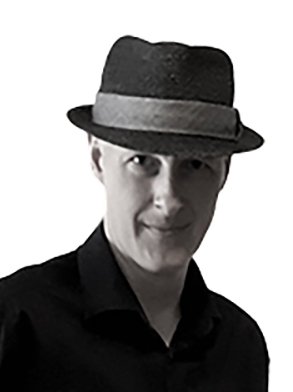</td>
    <td style="width: 80%;"> Stefan is an Open Science advocate with a docentship in English literature and a background in humanities scholarship. He is a senior advisor at SND and have previously worked as their domain specialist in the humanities. His research experience includes the CAPTURE project, where he investigated paradata in open data publications, and his most recent book (on the social commentary in urban fantasy) was published with diamond open access from Lever Press.    </td>
</tr>
</table>

  

## Karin Engström     {.instructor-name}
[Associate Professor, Researcher, Lund University]{.instructor-role}

<table>
<tr>
    <td style="width: 20%;">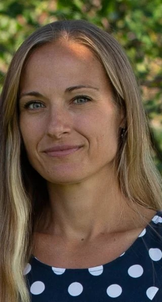</td>
    <td style="width: 80%;">  Karin Engström is an Associate Professor in the Division of Occupational and Environmental Medicine at Lund University and head of the Epidemiology and Bioinformatics group (EPI@BIO). Karin's research focuses on epigenetics, genetic epidemiology, and environmental medicine, with expertise in bioinformatics and multi-omics data. In addition to her research, she teaches doctoral courses in medical bioinformatics and data analysis in R. </td>
</tr>
</table>

 

## Mattias von Feilitzen   {.instructor-name}
[Educational Developer, University of Gothenburg]{.instructor-role} 

<table>
<tr>
    <td style="width: 20%;">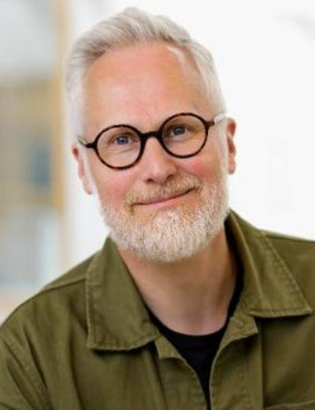</td>
    <td style="width: 80%;"> Mattias von Feilitzen is Educational Developer at the Department of Applied IT at the University of Gothenburg and director of Gothenburg Knowledge Lab. He has taught teacher-training courses for over 20 years and is particularly interested in how digitization and digital tools affect higher education and schools. In recent years, his work has increasingly focused on generative AI and its significance for education. He works to strengthen teachers' understanding of the role of digitalisation in education and how digital tools, including AI, can be used in a conscious and responsible manner. </td>
</tr>
</table>

 

## Helena Francke   {.instructor-name}
[Librarian, University of Gothenburg]{.instructor-role} 

<table>
<tr>
    <td style="width: 20%;">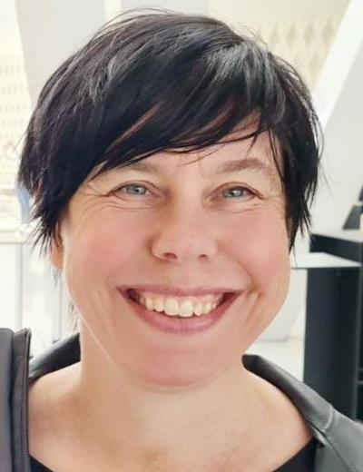</td>
    <td style="width: 80%;"> Helena Francke is an associate professor of Library and Information Science at the University of Borås. She also works as a librarian focusing on research- and publishing support at the Social Sciences Libraries at the University of Gothenburg. She has extensive national and international experience in teaching, research, and academic library practice in the areas of academic publishing and open science.</td>
</tr>
</table>

 

## Karl-Magnus Johansson    {.instructor-name}  
[Senior Archivist at the Swedish National Archives / Honorary Doctor at the Faculty of Humanities at the University of Gothenburg.]{.instructor-role}  

<table>
<tr>
    <td style="width: 20%;">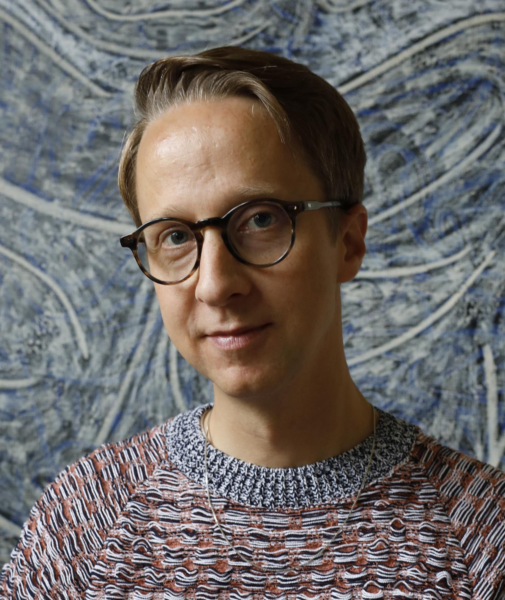</td>
    <td style="width: 80%;">Karl-Magnus is an archival researcher combining public engagement and cultural heritage.  His work explores archival theory and microhistory, ranging from records of the 1834 cholera outbreak in Gothenburg to forgotten speeches and everyday photographs. Through collaborations with artists, researchers, and the public, Karl-Magnus has made the archive come to life, making history accessible and relevant to broader audiences. </td>
</tr>
</table>

  

## Elin Kronander    {.instructor-name}
[Head of Training and Data Steward, NBIS]{.instructor-role} 

<table>
<tr>
    <td style="width: 20%;">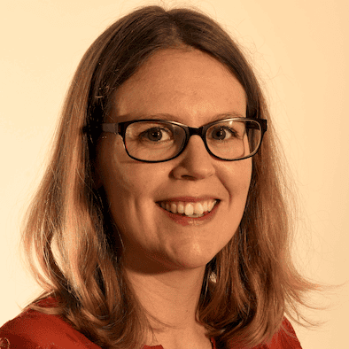</td>
    <td style="width: 80%;"> Elin leads initiatives to enhance data management and bioinformatics education. With expertise in implementing FAIR data principles, she supports researchers across Sweden's scientific community in managing and sharing data effectively to promote open science.  </td>
</tr>
</table>

  

## Ineke Luijten    {.instructor-name}  
[Scientific Training Officer, SciLifeLab Training Hub]{.instructor-role}  

<table>
<tr>
    <td style="width: 20%;">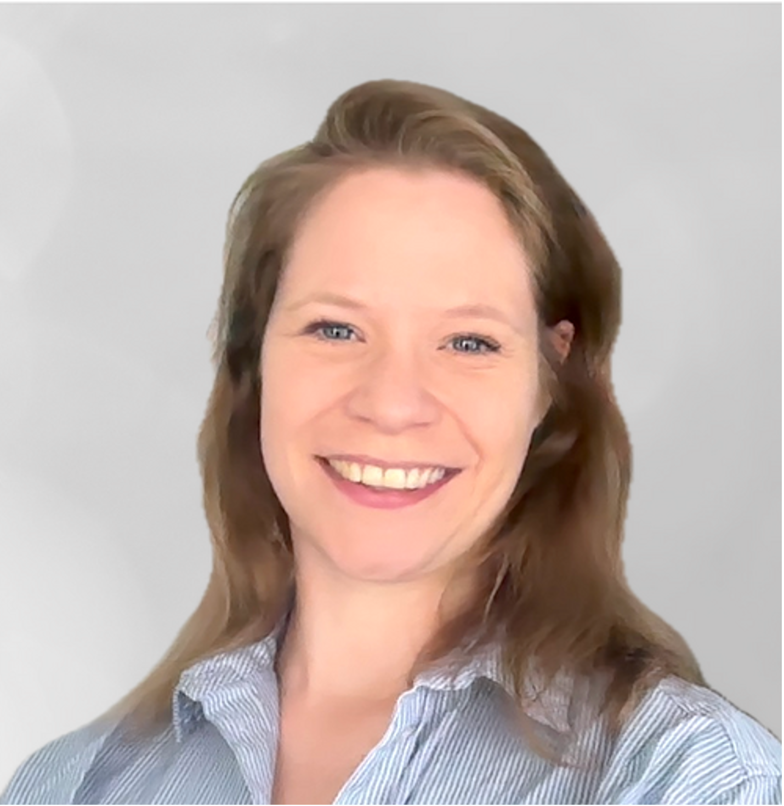</td>
    <td style="width: 80%;">Ineke develops and delivers cross-disciplinary training modules on Open Science and FAIR principles. She is a member of the Open Science community and a strong advocate for Open Science and FAIR. </td>
</tr>
</table>

  

## Gustav Nilsonne     {.instructor-name}  
[Associate Professor/Senior Advisor, Karolinska Institutet/SND]{.instructor-role}

<table>
<tr>
    <td style="width: 20%;">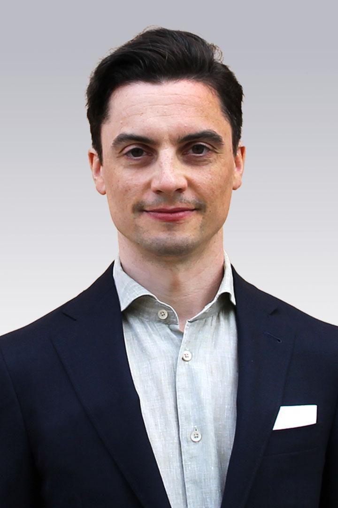</td>
    <td style="width: 80%;">Gustav Nilsonne is Associate Professor of neuroscience and Senior Advisor to the Swedish National Data Service. He is active in metascience, investigating transparency and reproducibility of medical research. He also works in basic research in neuroscience (e.g. sleep and diurnal rhythms) as well as translational research (biomarkers in psychiatry, exhaustion syndrome).</td>
</tr>
</table>

    

## Stephan Nylinder   {.instructor-name}  
[Data Steward, NBIS]{.instructor-role}

<table>
<tr>
    <td style="width: 20%;">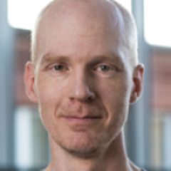</td>
    <td style="width: 80%;">Stephan is a Data Steward at the National Bioinformatics Infrastructure Sweden (NBIS) working towards FAIR and open science, and assisting Life Science researchers with data submissions of biological data to open repositories. He has a background as researcher in biodiversity and plant systematics.</td>
</tr>
</table>

    

## Camilla Pettersson   {.instructor-name}
[Team Leader, Innovation Office, University of Gothenburg]{.instructor-role} 

<table>
<tr>
    <td style="width: 20%;">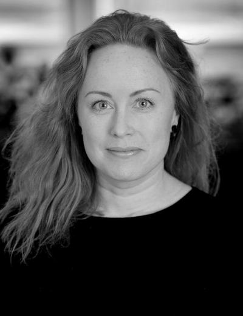</td>
    <td style="width: 80%;"> Camilla Pettersson is team leader for Innovation Office at the University of Gothenburg. In her role, she works primarily with planning and managing the Office's activities, as well as strategy and development of the university's support for the utilization of knowledge and research.
She holds a master's degree in molecular biology and a PhD in medicine, as well as training in journalism and communication. She has worked as an innovation advisor since 2011 and as a team leader since 2019. Her areas of expertise include journalism, communication, collaboration with external partners, innovation, knowledge transfer, and the utilization of research in society.
</td>
</tr>
</table>

 

## David Rayner      {.instructor-name}
[Training Coordinator, SND]{.instructor-role}

<table>
<tr>
    <td style="width: 20%;">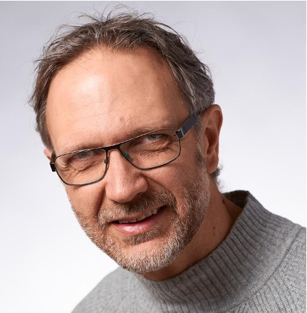</td>
    <td style="width: 80%;"> David coordinates education ventures for the Swedish National Data service. He liaises with researchers and domain specialists to identify new functionality and training needs.   </td>
</tr>
</table>

 

## Arin Tham  {.instructor-name}
[Research data Advisor, SND]{.instructor-role} 

<table>
<tr>
    <td style="width: 20%;">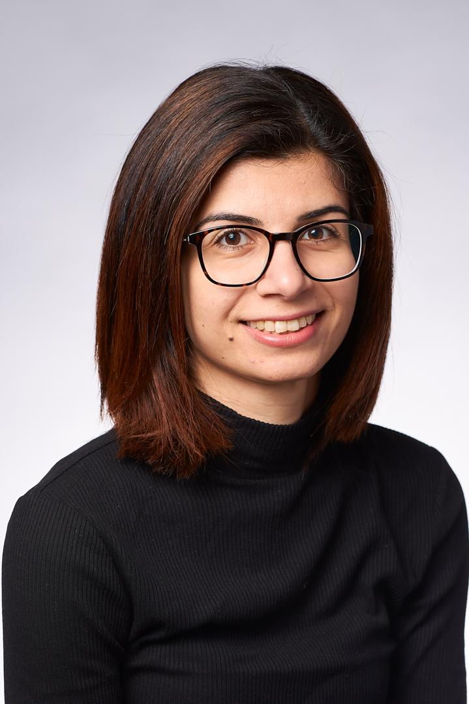</td>
    <td style="width: 80%;"> Arin has a Ph.D. in Peace and Conflict Studies. She works primarily with qualitative data and has coordinated SND:s participation in the Horizon Europe funded 'Skills4EOSC' project.   </td>
</tr>
</table>

 

## Karin Westin Tikkanen    {.instructor-name}  
[Journalist/Senior Advisor, SND/Gothenburg University]{.instructor-role}

<table>
<tr>
    <td style="width: 20%;">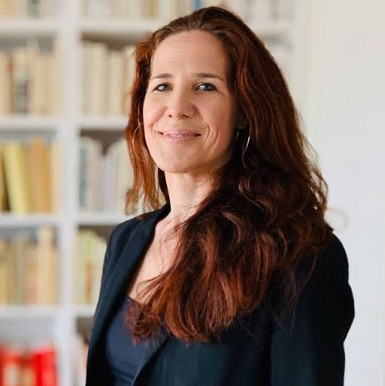</td>
    <td style="width: 80%;"> Karin has long experience when it comes to writing and lecturing on popular science communication. Her background is in the Humanities sector (Classical languages and Comparative Philology), and she is also a trained journalist and regularly writes popular science pieces also on scientific research. She is a senior advisor at SND, and is also the chair of Minerva, the section for narrative non-fiction of the Swedish Writers’ Union. </td>
</tr>
</table>

 

## Marcus Weissenbilder    {.instructor-name}  
[Survey Manager, the SOM Institute]{.instructor-role}

<table>
<tr>
    <td style="width: 20%;">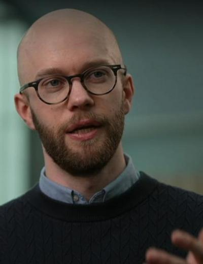</td>
    <td style="width: 80%;"> With a background in political science and public administration, Marcus is analyst and research lead at the SOM Institute. His specialities include survey design, data validation, and statistical analysis, and he works closely with government agencies and research groups. His research focuses on public trust in institutions, attitudes toward the EU, and perspectives on AI and the labor market. He regularly presents findings to policymakers, organizations, and in public forums, including SVT’s Agenda and at Almedalen. </td>
</tr>
</table>

<!--
 

#### NAME   
###### ROLE, ORG 

<table>
<tr>
    <td style="width: 20%;"></td>
    <td style="width: 80%;"> BIO  </td>
</tr>
</table>

 
  

-->
  

