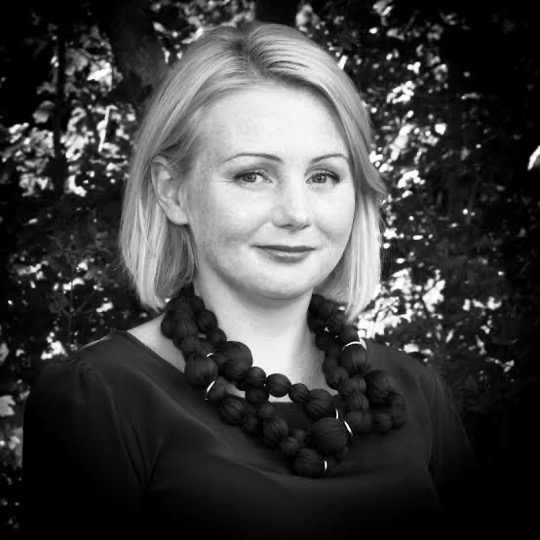
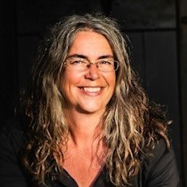
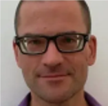
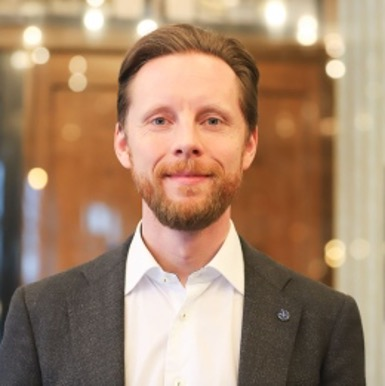
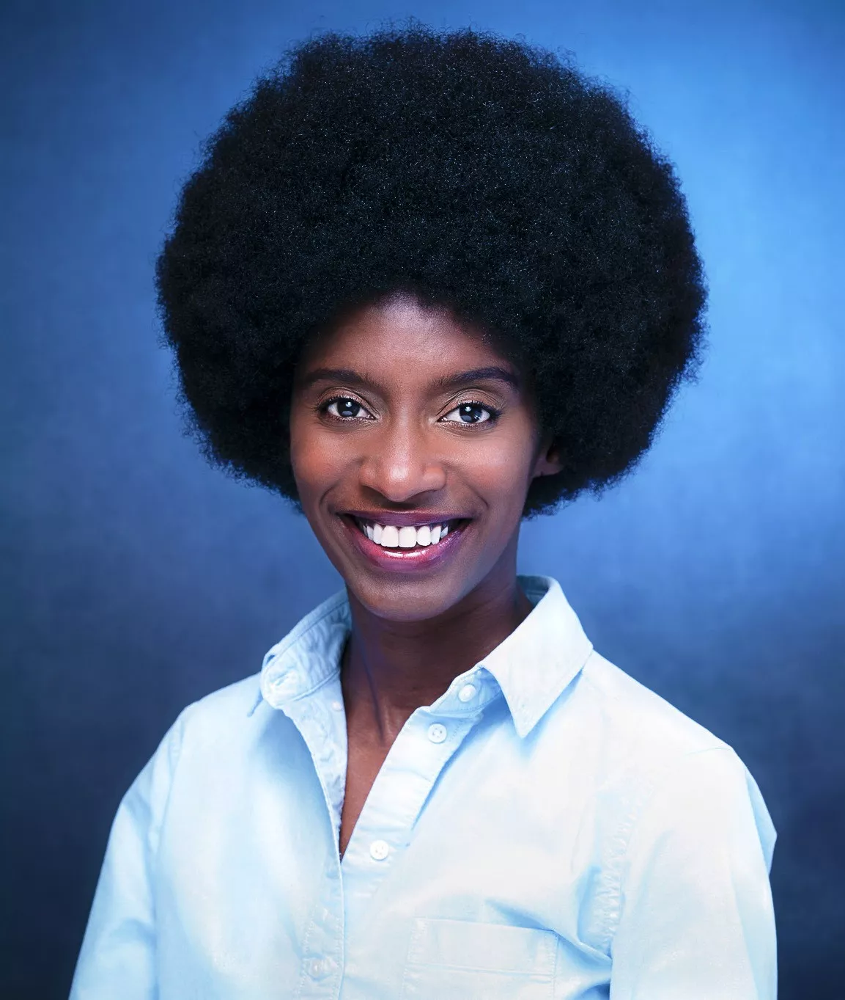
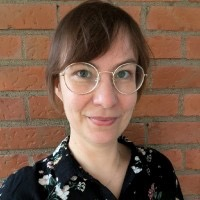
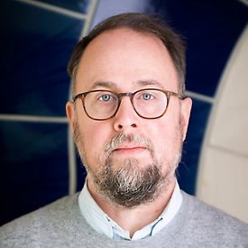
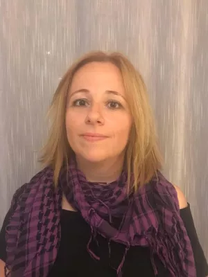
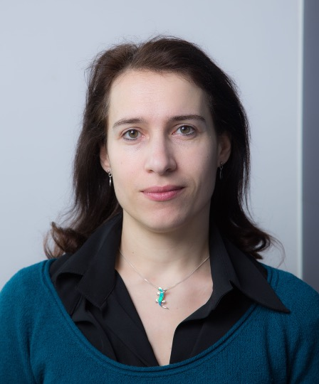

 

#### Stefan Ekman    
###### Training Coordinator, SND 

<table>
<tr>
    <td style="width: 20%;"></td>
    <td style="width: 80%;"> Karin Engström is an Associate Professor in the Division of Occupational and Environmental Medicine at Lund University and head of the Epidemiology and Bioinformatics group (EPI@BIO). She also works as a bioinformatics coordinator for the Faculty of Medicine and is involved in the Lund University Bioinformatics Infrastructure (LUBI).
Karin's research focuses on epigenetics, genetic epidemiology, and environmental medicine, with expertise in bioinformatics and multi-omics data. In addition to her research, she teaches doctoral courses in medical bioinformatics and data analysis in R and organizes the LUBI seminar series.   </td>
</tr>
</table>

 

#### Karin Engström    
###### Professor, Researcher, Lund University

<table>
<tr>
    <td style="width: 20%;"></td>
    <td style="width: 80%;"> Stefan is an Open Science advocate with a docentship in English literature and a background in humanities scholarship. He is a senior advisor at SND and have previously worked as their domain specialist in the humanities. His research experience includes the CAPTURE project, where he investigated paradata in open data publications, and his most recent book (on the social commentary in urban fantasy) was published with diamond open access from Lever Press.   </td>
</tr>
</table>

 

#### Mattias von Feilitzen  
###### Educational Developer, University of Gothenburg 

<table>
<tr>
    <td style="width: 20%;"></td>
    <td style="width: 80%;"> Mattias von Feilitzen is Educational Developer at the Department of Applied IT at the University of Gothenburg and director of Gothenburg Knowledge Lab. He has taught teacher-training courses for over 20 years and is particularly interested in how digitization and digital tools affect higher education and schools. In recent years, his work has increasingly focused on generative AI and its significance for education. He works to strengthen teachers' understanding of the role of digitalisation in education and how digital tools, including AI, can be used in a conscious and responsible manner. </td>
</tr>
</table>

 

#### Helena Francke  
###### Librarian, University of Gothenburg 

<table>
<tr>
    <td style="width: 20%;"></td>
    <td style="width: 80%;"> Helena Francke is a Library and Information Science professional with a shared position between the Social Sciences Library and Digital Services at the University of Gothenburg. She has extensive national and international experience in teaching, research, and academic library practice.
Her work focuses on supporting doctoral students and faculty with information seeking and publishing strategies, particularly in relation to academic publishing and open access. She is passionate about making academic knowledge and cultural heritage accessible to readers and students worldwide in an open and inclusive way.</td>
</tr>
</table>

 

#### Elin Kronander     
###### Head of Training and Data Steward, NBIS  

<table>
<tr>
    <td style="width: 20%;"></td>
    <td style="width: 80%;"> Elin leads initiatives to enhance data management and bioinformatics education. With expertise in implementing FAIR data principles, she supports researchers across Sweden's scientific community in managing and sharing data effectively to promote open science.  </td>
</tr>
</table>

  

#### Ineke Luijten     
###### Scientific Training Officer, SciLifeLab Training Hub  

<table>
<tr>
    <td style="width: 20%;"></td>
    <td style="width: 80%;">Ineke develops and delivers cross-disciplinary training modules on Open Science and FAIR principles. She is a member of the Open Science community and a strong advocate for Open Science and FAIR. </td>
</tr>
</table>
  
    

#### Camilla Pettersson  
###### Librarian, University of Gothenburg 

<table>
<tr>
    <td style="width: 20%;"></td>
    <td style="width: 80%;"> Camilla Pettersson is group leader for Innovation and Utilization at the Research and Innovation Office, University of Gothenburg. In her role, she works primarily with operational planning, strategy, and developing the university's support for the utilization of knowledge and research.
She has a master's degree in molecular biology and a PhD in medicine. Her areas of expertise include journalism, communication, collaboration with external partners, innovation, knowledge transfer, and the utilization of research in society.</td>
</tr>
</table>

 

 

#### David Rayner     
###### Training Coordinator, SND

<table>
<tr>
    <td style="width: 20%;"></td>
    <td style="width: 80%;"> David coordinates education ventures for the Swedish National Data service. He liaises with researchers and domain specialists to identify new functionality and training needs.   </td>
</tr>
</table>

 

#### Arin Tham 
###### Research data Advisor, SND 

<table>
<tr>
    <td style="width: 20%;"></td>
    <td style="width: 80%;"> Arin has a Ph.D. in Peace and Conflict Studies. She works primarily with qualitative data and has coordinated SND:s participation in the Horizon Europe funded 'Skills4EOSC' project.   </td>
</tr>
</table>

 

#### Karin Westin Tikkanen     
###### Journalist/Senior Advisor, SND/Gothenburg University

<table>
<tr>
    <td style="width: 20%;"></td>
    <td style="width: 80%;"> Karin has long experience when it comes to writing and lecturing on popular science communication. Her background is in the Humanities sector (Classical languages and Comparative Philology), but she regularly writes popular science pieces also on scientific research. She is a board member of Minerva, the section for narrative non-fiction of the Swedish Writers’ Union. </td>
</tr>
</table>

<!--
 

#### NAME   
###### ROLE, ORG 

<table>
<tr>
    <td style="width: 20%;"></td>
    <td style="width: 80%;"> BIO  </td>
</tr>
</table>

#### Jessica Lindvall, PhD   
##### Head of Training, SciLifeLab Training Hub   

<table>
<tr>
    <td style="width: 20%;"></td>
    <td style="width: 80%;">Jessica heads the Training Hub at SciLifeLab, a national Research Infrastructure within the life science domain. She is a strong Open Science and FAIR advocate involved in various national and international Open Science and FAIR capacity building and upskilling work. </td>
</tr>
</table>
  
    
 

#### Sabina Anderberg   
##### Senior Advisor, SUHF & Stockholm University   

<table>
<tr>
    <td style="width: 20%;"></td>
    <td style="width: 80%;">   </td>
</tr>
</table>
  
    
 

#### Till Brückner     
##### Postdoctoral fellow - clinical trial reporting, Karolinska Institute   

<table>
<tr>
    <td style="width: 20%;"></td>
    <td style="width: 80%;">   </td>
</tr>
</table>
  
    
 

#### Jonas Åkerman   
##### Coordinator for research ethics, Stockholm University  

<table>
<tr>
    <td style="width: 20%;"></td>
    <td style="width: 80%;">   </td>
</tr>
</table>
  
    
 

#### Abeni Wickham    
##### Founder/CEO, SciFree 

<table>
<tr>
    <td style="width: 20%;"></td>
    <td style="width: 80%;">   </td>
</tr>
</table>
  
    
 

#### Sanna Isabel Ulfsparre    
##### Analyst, Vetenskapsrådet 

<table>
<tr>
    <td style="width: 20%;"></td>
    <td style="width: 80%;">   </td>
</tr>
</table>

 

#### Erik Stattin    
##### Unit manager *Research Collaboration*, Kungliga Biblioteket 

<table>
<tr>
    <td style="width: 20%;"></td>
    <td style="width: 80%;">   </td>
</tr>
</table>

 

#### Angeliki Adamaki    
##### Project manager, Lund University 

<table>
<tr>
    <td style="width: 20%;"></td>
    <td style="width: 80%;">   </td>
</tr>
</table>

 

#### Sabina Leonelli    
##### Professor of Philosophy and History of Science, Technical University of Munich 

<table>
<tr>
    <td style="width: 20%;"></td>
    <td style="width: 80%;">   </td>
</tr>
</table>
  

-->
  

