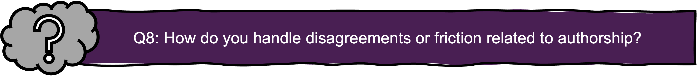

**Reading time: 7 min  &nbsp;&nbsp;&nbsp;&nbsp;&nbsp;&nbsp;&nbsp;&nbsp;&nbsp;&nbsp;&nbsp;&nbsp;&nbsp;&nbsp;&nbsp;&nbsp;&nbsp;&nbsp;&nbsp;&nbsp;&nbsp;&nbsp;&nbsp;&nbsp;&nbsp;&nbsp;&nbsp;&nbsp;&nbsp;&nbsp;&nbsp;&nbsp;&nbsp;&nbsp; Reflection question #: 8, 9**  

### **Writing** 
As a researcher, your scientific publications are a primary way to share your findings with the world. Upholding GRP in publishing ensures that your work is transparent, honest, and responsible—building trust within the research community and beyond.  
According to [VR (2024)](https://www.vr.se/uppdrag/etik/god-forskningssed---ny-utgava.html), responsible scientific publishing means::   

-	Presenting data, methods, results and interpretations in an **open, honest, transparent and correct** manner, while meeting the interest in protection and legitimate demands for confidentiality  
-	clearly reporting **study robustness**, assumptions and values, **sources of error** and remaining uncertainties and knowledge gaps   
-	referring and **citing clearly and correctly**, in accordance with the standard that applies to the research area   
-	openly reporting any **conflicts of interest**, financial support and dependencies   
-	preventing the dissemination and use of **incorrect results** or **misleading information**    
  
By following these principles, you ensure that your research is credible, reproducible, and impactful.

### **Authorship** 
Determining authorship can be one of the most sensitive aspects of publishing. The [Vancouver recommendations](https://www.icmje.org/icmje-recommendations.pdf) provide a clear four-step framework to define who qualifies as a co-author. To be listed, a researcher must:

1. Make a substantial contribution to the conception or design of the work; or the acquisition, analysis, or interpretation of data for the work; AND   
2. Write or critically revise the manuscript for intellectual content; AND  
3. Approve the final version before submission; AND    
4. Take responsibility for the integrity of all aspects of the work and be accountable for any concerns about accuracy  
  
    
   
If you use AI tools to generate text or content, you must disclose this and ensure that AI-generated contributions are reliable and ethically integrated into your work.

### **Journal selection** 
When selecting a journal, prioritize those that uphold rigorous peer-review standards. Avoid journals that lack transparency in their review process, charge hidden fees, or compromise on quality.

Ensure your research is accessible to both peers and the public as soon as possible, while respecting legitimate delays—such as those related to patent applications.

### **Peer review** 
If you are reviewing manuscripts from peers, you play a critical role in maintaining research quality. Ethical peer review, as outlined by the Committee on Publication Ethics' (COPE) [ethical guidelines](https://web.sciedu.ca/images/COPE/Ethical_Guidelines_For_Peer_Reviewers_2.pdf), requires that you:

- Provide an honest assessment  
- Provide a well-founded assessment  
- Disclose any conflicts of interest that could bias your review  
- Refrain from participating if there is a risk of undue influence  

    
     
Researchers must also help counteract publication bias by supporting the publication of valid studies, regardless of whether the results confirm or reject a hypothesis

   

  <a href="SS_GRP4.qmd" style="padding: 10px; background-color: #007bff; color: white; text-decoration: none; border-radius: 5px;">Previous</a>
  <a href="SS_GRP6.qmd" style="padding: 10px; background-color: #007bff; color: white; text-decoration: none; border-radius: 5px;">Next</a>

