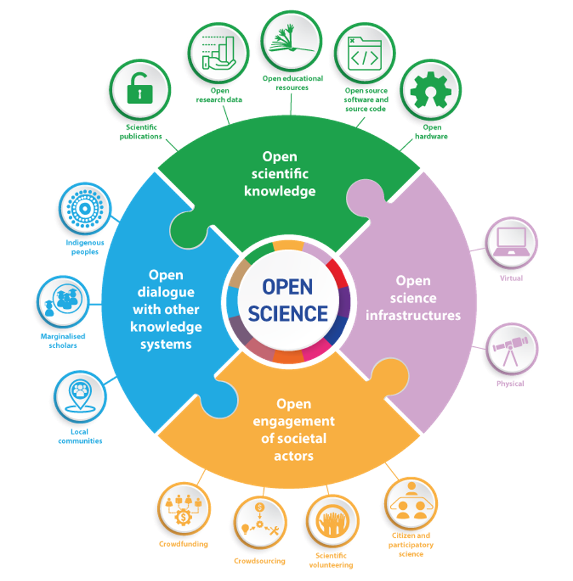
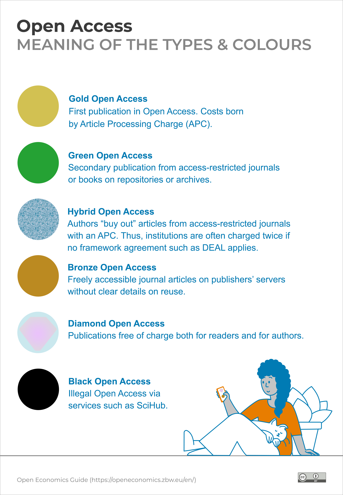

  

Pre-course assignment related to Module 1: Open Science in Sweden

::: {.callout-note icon=false}
## About

This pre-course assignment is related to module 1 of the 'Open Science in the Swedish Context' in-person workshop, and is developed to familiarize students with the Swedish *National Guidelines for Open Science*. 

**Upon completion of this assignment, students will be able to:** Analyze one of the six areas of Open Science in which development is ongoing in Sweden   
**Mode of study:** self-paced  

*Please read through the introduction below, pick the topic that interests you most, and read the relevant material. We will build on these topics during the in-person workshop on March 20th.* 
  
**Total assignment time: ~ 15min**   

:::  
## Introduction   
Open Science is all about making scientific research, data, and knowledge available to everyone. It's a [global movement](https://www.unesco.org/en/open-science/about?hub=686) that encourages **transparency, collaboration, and sharing ideas freely**. This makes it easier for researchers to build on each other's work, speed up innovation, and improve the trustworthiness and accuracy of research results.

<figcaption>The 4 key pillars Open Science is built on, and the areas within Open Science they refer to. Unesco (2022) Understanding Open Science, https://doi.org/10.54677/UTCD9302, [CC BY-SA 3.0 IGO](https://creativecommons.org/licenses/by-sa/3.0/igo/)</figcaption>
</figure>  
 
    

In Sweden, Open Science has become a big priority for the government, universities, and funding bodies in recent years. In 2017, the Swedish government tasked The Royal Library (Kungliga Biblioteket, KB) with leading the charge to make research publications freely accessible. The Swedish Research Council (Vetenskapsrådet, VR) has been tasked with making research data publicly available. These efforts have laid the groundwork for bringing Open Science practices into Swedish higher education.

Right now, Sweden is still in the process of fully transitioning to Open Science. To help guide this change, KB created the [National Guidelines for Open Science](https://www.kb.se/samverkan-och-utveckling/nytt-fran-kb/nyheter-samverkan-och-utveckling/2024-08-27-national-guidelines-for-open-science---now-in-english.html), in which areas within Open Science that are prioritised and crucial to develop fully in Sweden are highlighted. These areas are:
  
- Open access to scholarly publications  
- Open access to research data  
- Open research methods  
- Open educational resources  
- Public engagement in science  
- Infrastructures supporting open science  
  
During the in-person workshop on March 20th, [Module 1](1_OpenScienceInSweden.qmd) will explore the state of Open Science in Sweden, especially focusing on the National Guidelines. This pre-course assignment is designed to help you get familiar with the guidelines before the workshop kicks off.
  
    
## Assignment  
  
### Step 1: 
Please open the document made available to you via a link you've received per email and add your name to the area you are most interested in. There are 2 groups for each area and every group can consist of a maximum of 5 people. Areas are available on a first come, first serve basis.  
 
### Step 2:  
Read the sections of the *National Guidelines for Open Science* relevant to your chosen area. The Guidelines can be accessed [here](https://www.kb.se/samverkan-och-utveckling/nytt-fran-kb/nyheter-samverkan-och-utveckling/2024-08-27-national-guidelines-for-open-science---now-in-english.html) by clicking 'Read the national guidelines for open science'.   

Pages to read per group are as follows:   
- Groups 1.1 & 2.1: pages 8-10, the heading 'Open Access to scholarly publications'  
- Groups 1.2 & 2.2: pages 10-11, the heading 'Open Access to research data'  
- Groups 1.3 & 2.3: pages 11-12, the heading 'Open research methods'  
- Groups 1.4 & 2.4: pages 12-13, the heading 'Open Educational Resources'  
- Groups 1.5 & 2.5: pages 13-15, the heading 'Public engagement in science'  
- Groups 1.6 & 2.6: pages 15-16, the heading 'Infrastructures supporting Open Science' 
   

  

Pre-course assignment related to Module 3: Open Science in project sharing & publishing

  
  
::: {.callout-note icon=false}

## About

This pre-course assignment is related to module 3 of the 'Open Science in the Swedish Context' in-person workshop, and is developed to familiarize students with the different types of Open Access publishing.

**Upon completion of this assignment, students will be able to:**   
- Analyze different types of Open Access publishing  
**Mode of study:** self-paced  

*Please read through the introduction below, listen to the podcast, and complete the assignment. We will collect the answers during the in-person workshop on March 20th.* 
  
**Total assignment time: ~ 2h**   

:::  
 
  
## Introduction

Open Access publishing is the widely adopted ideal that all should have equitable access to the information generated by research.

There are six different types of OA publishing currently recognized. Below is an overview of the different types.

  
    
  
To prepare for the in-person workshop, listen to the following discussion between researchers, journal editors, and EMBO Open Science professionals on publishing, the move to more Open Access, and the future of journal articles:

> [The EMBO Podcast - A stepping stone to an Open Science Future](https://www.embo.org/podcasts/a-steppingstone-to-an-open-science-future-embo-press-moves-to-full-open-access/)

If you would like more in-depth information on Open Access publishing, check out the following article:

> Piwowar H, Priem J, Larivière V, Alperin JP, Matthias L, Norlander B, Farley A, West J, Haustein S. 2018. The state of OA: a large-scale analysis of the prevalence and impact of Open Access articles. PeerJ 6:e4375 [https://doi.org/10.7717/peerj.4375](https://doi.org/10.7717/peerj.4375)

## Assignment
 **Bring your answers to the in-person workshop!**   
  
### Part 1
Choose two OA publishing types (Gold, Green, Hybrid, Bronze, Diamond, Black) and answer the following ten questions. 

::: {.callout-tip}
To find articles, compare a society journal and an Elsevier or Nature journal in the DDLS field. You can also use the search engine [OA.mg](https://OA.mg)!
:::

<table>
  <thead>
    <tr style="border-bottom: 0.5px solid #808080;">
      <th style="width: 100%;">Questions</th>
    </tr>
  </thead>
  <tbody>
    <tr>
      <td>1. List which two publishing types you have chosen</td>  
    </tr>
    <tr>
      <td>2. Link an article published with the first OA type</td>
    </tr>
    <tr>
      <td>3. What is the advantage of publishing with this type?</td>
    </tr>
    <tr>
      <td>4. Link an article published with the second OA type</td>
    </tr>
    <tr>
      <td>5. What is the advantage of publishing with this type?</td>
    </tr>
    <tr>
      <td>6. How could you tell what OA type these articles are published with?</td>  
    </tr>
    <tr>
      <td>7. Who paid for publishing of these two articles?</td>
    </tr>
    <tr>
      <td>8. What is the main difference between these two publishing types?</td>
    </tr>
    <tr>
      <td>9. How could a trapeze artist in Borås access these articles?</td>
    </tr>
    <tr style="border-bottom: 0.5px solid #808080;">
      <td>10. How could a student at your host university access these articles?</td>
    </tr>
  </tbody>
</table>

### Part 2
What access type was the most recent paper you (or someone in your research group) were an author on?

