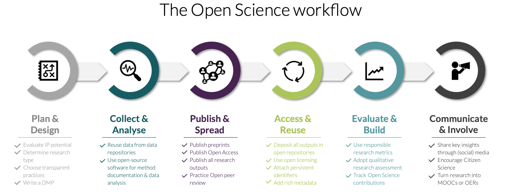

::: {.callout-tip}
### About
**Purpose:**   
To develop an understanding of what Open Science entails and introduce the practical implications of Open Science for PhD students. 

**Learning outcomes:**   
Upon completion of this assignment, participants will be able to:

- Explain how national Open Science guidelines translate into concrete expectations for researchers in Sweden.
- Identify realistic, actionable steps for implementing Open Science practices within the participants' own research project.

**Duration:**   
90min

**To-do:**   
Before this session, complete [assignment 1](Assignment1.qmd) and [group assignment 2](Assignment2.qmd) 
:::

## 1.1 Presentation

Here you can find the presentation for this session:

<iframe src="https://docs.google.com/presentation/d/e/2PACX-1vReKsLNaO-R4aO68MHzNGrbuMTxP0itGrLhj9WQjrjCMW-Rp3jIbKMRvAr0FNDfjA/pubembed?start=false&loop=false&delayms=3000" frameborder="0" width="640" height="389" allowfullscreen="true" mozallowfullscreen="true" webkitallowfullscreen="true"></iframe>

  <strong>Reuse:</strong> 
    <a href="https://docs.google.com/presentation/d/1n9l7ezweX9-evuI56_sgBkeZzs2uZxJn/view" target="_blank">View in Google Slides</a> | 
    <a href="https://docs.google.com/presentation/d/1n9l7ezweX9-evuI56_sgBkeZzs2uZxJn/copy" target="_blank">Make a Copy</a> 

## 1.2 Introduction

This session brings together the two self-study assignments you completed before the workshop. Rather than repeating what you read, the goal is to **put that knowledge to work**: to move from understanding what Open Science is and how it is governed in Sweden, to thinking critically about what it means *in practice* for your own PhD project.

The session is structured as a workshop. After a short interactive introduction, you will present your group work to translate national Open Science policy into concrete, realistic actions, and to pressure-test those actions against the reality of doing a PhD.

## 1.3 Open Science: from policy to practice

::: {.callout-note title="Assignment"}
Here, you will present your group work from [assignment 2](Assignment2.qmd) 

Each group will:
 
1. Present their plain-language summary (slide 1, maximum 2 minute total).
2. Present their three concrete action (slide 2) 
    The audience will vote using colored cards:    
    🟢 Green = Realistic for most PhD students   
    🟠 Orange = Depends on field or context   
    🔴 Red = Largely unrealistic or very difficult.   
    We will briefly discuss why participants voted differently   
3. Pose their discussion question   
    We will discuss for 5–10 minutes before moving to the next group.

:::

## 1.4 The Open Science workflow
Throughout this course, we will use an Open Science workflow to map open practices onto the research lifecycle, outlined below: 

{ fig-align="left"}

The full workflow covers six stages, from planning and data collection through to communication and evaluation. In this course, we focus on four: Plan & Design, Publish & Spread, Communicate & Involve, Evaluate & Build. 
The stages Collect & Analyse and Access & Reuse will be covered in detail in the DDLS Research School course 
[Principles and tools for FAIR research practices](https://uppsala.instructure.com/courses/122228). 

## 1.5 Key session takeaways

- **'As open as possible, as closed as necessary'** is the most important guiding principle in Open Science. Use it to make reasoned decisions, not to default to either extreme.

- **Three Swedish legal principles** — academic freedom, allmänna handlingar, and lärarundantaget — already embed openness into your research.

- **Open Science is not just open access.** It touches every stage of the research lifecycle, from planning and data collection to publication, communication, and evaluation.

- **You are not responsible for everything.** Funders, universities, and national agencies each carry part of the Open Science burden. Understanding who does what helps you focus your own effort where it actually matters.  

- **Support exists.** Your university library, your data steward, SND, and SciLifeLab's data infrastructure are all there to help you. The most important Open Science skill is often simply knowing who to ask.

## Reuse
### Contributors

- Ineke Luijten 

### License  

All materials from this session are available for re-use under 

### Please cite material as:   
   
> Ineke Luijten (2026) *Open Science in the Swedish context, DDLS Research school. Session 1: Open Science in Sweden*. Retrieved from https://scilifelab-training.github.io/open-science/2603/Session1.html   

