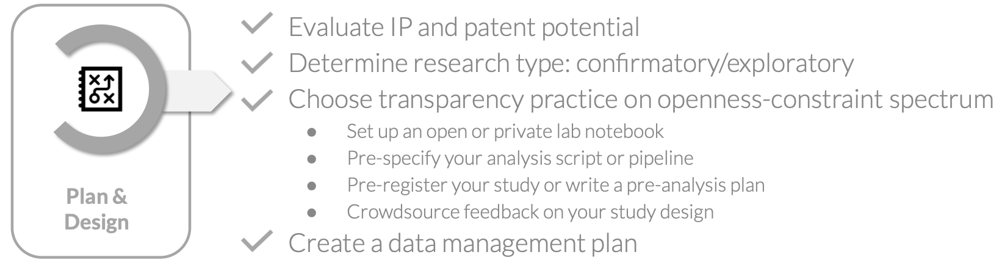
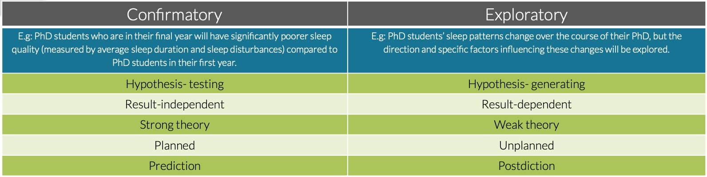
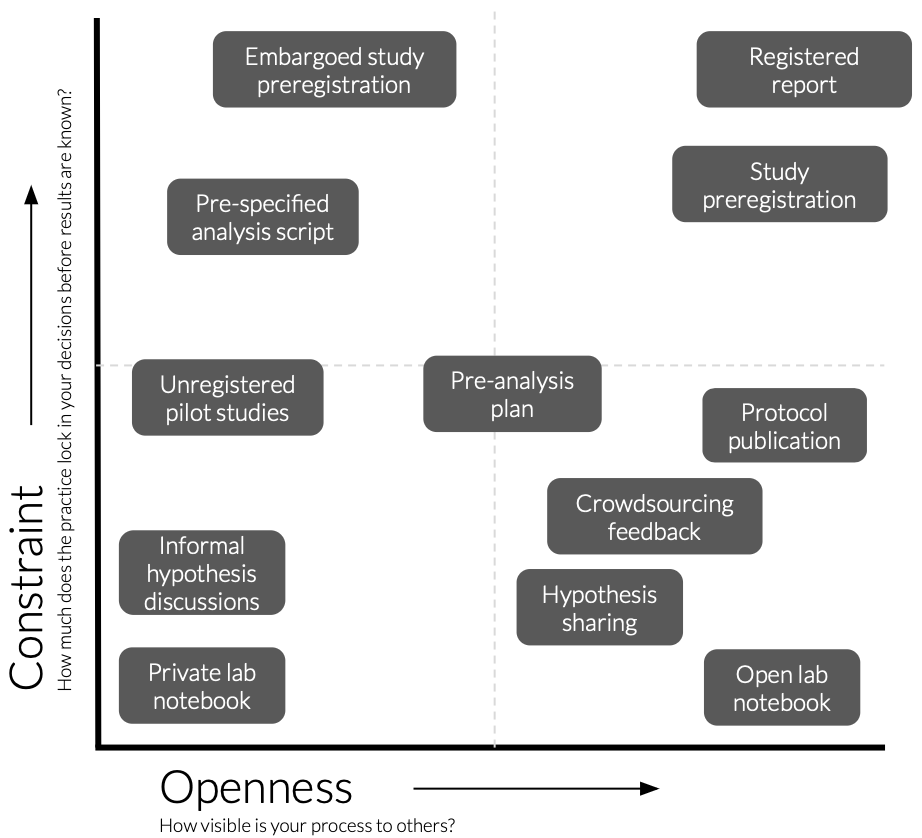
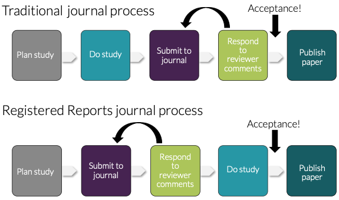

::: {.callout-tip}
### About
**Purpose:**   
To help participants identify the transparency practices in the plan and design stage of research that are most appropriate for their own project, taking into account both intellectual property considerations and their research type.

**Learning outcomes:**   
Upon completion of this assignment, participants will be able to:

- Evaluate intellectual property considerations in their projects
- Distinguish between confirmatory and exploratory research approaches 
- Select appropriate transparency practices and identify concrete actions they can take within their own project

**Duration:**   
75min

:::

## 2.1 Presentation

Here you can find the presentation for this session:

<iframe src="https://docs.google.com/presentation/d/e/2PACX-1vR0RxxU8lk7a09uLu_KbJrkpUQav-fe9Kp1kKYrlnS2IMoz6IR7TXAMiEQPT7fS3-tLtGcSvzdBDjn8/pubembed?start=false&loop=false&delayms=3000" frameborder="0" width="640" height="389" allowfullscreen="true" mozallowfullscreen="true" webkitallowfullscreen="true"></iframe>

  <strong>Reuse:</strong> 
    <a href="https://docs.google.com/presentation/d/1hr-5zVQ2hGXQKFDwAHZmNQ1xUM9eka_PlIgQPkbPjy8/view" target="_blank">View in Google Slides</a> | 
    <a href="https://docs.google.com/presentation/d/1hr-5zVQ2hGXQKFDwAHZmNQ1xUM9eka_PlIgQPkbPjy8/copy" target="_blank">Make a Copy</a> 

## 2.2 Introduction

This session focuses on the first stage of the Open Science workflow: **plan and design**. Open Science in the planning and design stage is about making early decisions in your research transparent: **not to constrain your research, but to create an honest record of your intentions before results are known.**

The session is structured as a guided workshop. Rather than presenting a single, one-size-fits-all solution, the session starts from where you actually are: you will evaluate your own Intellectual Property (IP) situation and research type. We will map the range of research approaches in the room, and will then explore why transparency in research design matters. A spectrum of open practices in research project planning & designing will be introduced, from open lab notebooks to registered reports. Based on your IP situation and research type, you will evaluate where your project sits on the openness-constraint matrix and leave with one specific action to take forward.

{ fig-align="left"} 

## 2.3 The Open Science workflow: Plan & Design
The planning and design stage is where Open Science starts, before you have collected a single data point or run a single analysis. The decisions you make now about how to document, share, and structure your research will shape everything that follows. Thinking about openness at this stage is not just an administrative task to get out of the way: it is one of the most effective things you can do to improve the quality and credibility of your research.

### Why does openness in planning and design matter?
- **It reduces publication bias and increases reporting of null results**  
Research that produces positive, statistically significant results is far more likely to be published than research that produces null or negative results (see e.g. 1, 2, 3). Studies that find no effect tend to end up in the file drawer, written up but never submitted, or submitted and rejected. **This publication bias creates a systematic distortion in the published literature:** the evidence base looks more certain and more positive than the underlying reality of all the research conducted.   
This distortion has consequences. When researchers build on an inflated literature, funders invest in follow-up work that cannot replicate the original, and in clinical or applied contexts, decisions may be based on a systematically overstated picture of what works. **This is the replication crisis: the difficulty or inability to reproduce published scientific findings** that has been documented across psychology, cancer biology, neuroimaging, and many other fields (e.g. 4, 5, 6).  
**Sharing your experimental plan before data collection is one of the most effective responses to this problem.** Studies that are preregistered show a marked increase in null results compared to unregistered studies (e.g. 7, 8, 9), because it removes the incentive to selectively report only positive findings.

- **It improves planning & study design**  
Writing down your hypotheses, methods, and analysis plan before data collection forces a level of clarity that informal planning does not. It encourages a comprehensive overview of the study before you are committed to a path and helps you catch errors.

- **It enables early feedback when changes can still be made**  
Sharing your study design or protocol before data collection opens it up to input from  colleagues, collaborators, or the wider research community at a point when adjustments  are still straightforward. Making  your plans visible early turns design review from an exception into a normal part of  the research process, and creates natural opportunities for collaboration with researchers  working on related questions.

- **It protects you and your research from scooping and study cancellation**  
Sharing your plans publicly creates a verifiable, timestamped record that you had an idea first. This discourages direct copying, provides evidence in priority disputes, and can prevent accidental overlap with other researchers working on similar questions. These researchers may actually choose to collaborate rather than compete once they find your shared plan.   
If a study is cancelled for any reason, a shared plan also provides a record of the hypothesis, methodology, and reason for stopping, ensuring that your work is not simply lost if a project ends early or changes direction.

- **It limits questionable research practices (QRPs)**   
Between outright fraud and perfectly clean research lies a large grey zone of practices that are common, often not considered unethical, but that cumulatively distort the literature, termed QRPs. Early planning and design transparency addresses many QRPs directly, as outlined in the table below.  
However, transparency in planning and design does however not solve every QRP. It can for example not always prevent poor documentation of data handling or outright fabrication and falsification of data. QRPs that occur during manuscript writing (e.g. cherry-picking studies in literature reviews, salami slicing, and authorship disputes and conflicts of interest) can also not be prevented by transparency in planning and design.

| QRP | How transparency in planning and design helps |
|---|---|
| **HARKing** (Hypothesising After Results are Known) | Fixes hypotheses before data collection, so post hoc adjustments are visible as deviations |
| **Fishing / data dredging** | Requires analyses to be specified in advance, reducing the temptation to test many hypotheses and report only significant ones |
| **Overfitting** | Hypotheses are set before the data is seen, preventing tailoring of hypotheses to fit a specific dataset |
| **Undisclosed multiple testing** | All planned statistical tests must be specified upfront, preventing selective reporting of only significant tests |
| **P-hacking** | Pre-specified analyses make it detectable when extra tests are added after the fact to hunt for significance |
| **The garden of forking paths** | A clear analysis plan reduces arbitrary decision-making during analysis that could lead to different conclusions |
| **Optional stopping / data peeking** | Pre-specified sample size prevents stopping data collection as soon as a significant result appears |
| **Post hoc variable creation** | Variables must be defined in advance, preventing reclassification or redefinition of variables to produce desired results |
| **Undisclosed use of covariates** | Forces transparency about whether and which covariates will be included before analysis begins |
| **Spin and misrepresentation of results** | Creates a public record of planned outcomes that readers can compare against what was actually reported |
: {tbl-colwidths="[30,70]"}  

### Openness in your own project's planning and design
The goal of transparency in planning and design is to make your reasoning visible before your results are known to clearly separate what you intended from what you found. As outlined above, there are real benefits to doing this. However, there is no one-size-fits-all approach. The right transparency practice depends on your research type and your specific project context. Before you can decide how open to be, you first need to answer these two questions: 

***1. Does your project have IP or patent potential?***  
In biomedical and life sciences research, the following types of outputs are commonly 
patentable:

- Novel molecules, compounds, or drug candidates
- Diagnostic methods or biomarkers
- Therapeutic targets or treatment methods
- Novel laboratory methods, assays, or protocols
- Software or algorithms with a specific technical application
- Medical devices or instrumentation

To be patentable, an invention must meet three core criteria: it must be **novel** (not previously disclosed anywhere in the world), **inventive** (not obvious to someone skilled in the field), and **industrially applicable** (capable of being used in practice).   
The novelty requirement is where early sharing becomes critical: under European patent law, *any* public disclosure of an invention before a patent application is filed can invalidate the application entirely. This includes preprints, public OSF registrations, conference presentations, open lab notebook entries, and informal posts on research platforms.   
This does not mean IP-sensitive research cannot be open: it means the timing and format of openness need to be planned carefully.

***2. Is your research confirmatory or exploratory?***  
Different types of research have different relationships with transparency in the planning and design stage. The nature of your research shapes which transparency practices are appropriate and how you apply them.  
**Confirmatory research** (see table below) tests a predefined hypothesis with a structured plan. It is hypothesis-testing, results-independent, and based on strong prior theory. The study design, analyses, and predictions are planned before data collection begins, and the goal is to evaluate whether the data supports or refutes a specific prediction.  
**Exploratory research** operates without clear hypotheses and aims to generate new ideas or identify patterns in data. It is hypothesis-generating, result-dependent, and typically based on weaker prior theory. The research questions and analytical approaches often emerge from the data itself, making it inherently less structured in advance.

{ fig-align="left" width="80%"} 

Most PhD research involves elements of both. The key is to be explicit about which parts of your work are confirmatory and which are exploratory, and to choose your transparency practice accordingly. 

### The openness-constraint spectrum
  
Once you have determined if there is IP in your project and which elements in your project are confirmatory and explopratory, you can start implementing open practices in the planning and design of your project.  There is no single right answer for how to make your planning and design transparent. Instead, there is a spectrum of practices that vary along two axes:  

{ fig-align="left" width="50%"} 

**Openness: how visible can your process be to others?** From private and internal, through shared with collaborators and publicly archived, to fully public and citable.  

**Constraint: how much does the practice lock in your decisions before results are known?** From no pre-specification, through documenting decisions as they are made, to pre-specifying your analytical approach, to pre-specifying your hypothesis and analysis plan, to a peer-reviewed commitment made before data collection begins.  
  
The right position on this spectrum depends on your IP situation, your research type, your field's norms, and what is practically feasible at your career stage. For example, exploratory research without IP belongs in the high-openness, low-constraint quadrant, while confirmatory research without IP can aim for high openness and high constraint. Projects with IP by definition need to be in the low openness quadrants, but can still have varying levels of constraint. 

**To determine which transparency practices are right for you at the planning and design stage, work through the exercise below.**

## 2.4 Transparency practices for your own project

::: {.callout-note title="Assignment"}

This exercise helps you identify which transparency practices are realistic and appropriate for your own project. Work through the three steps below and record your findings on the **[worksheet](img/file_session2_worksheet.docx)**. 

* **Step 1: Map your project**   
Take a few minutes to answer the questions in the worksheet about your own PhD project. The goal of this is to determine which parts of your project involve potentially patentable or commercially sensitive material, and which do not; and which parts of your research are confirmatory and which are exploratory.

* **Step 2: Select one part to focus on**   
Choose one part of your project to focus on (ideally one that is active or starting soon) and identify which of the research profiles below most closely describes it. Now read through the transparency practices available for that profile and on the worksheet, identify 2-3 practices that feel most relevant to you. 

::: {.callout-note title="Profile 1: Confirmatory projects without IP" collapse="true"}
Your research tests a specific hypothesis with a structured design, and your outputs are not commercially sensitive. This is the profile where the full range of transparency practices is available to you, and where the evidence for the benefits of early sharing is strongest. You are encouraged to aim as high on the openness-constraint spectrum as your project allows.

Practices available:

| Practice | What it entails | Tools |
|---|---|---|
| **Hypothesis sharing** | Publicly stating your research question or prediction before you have results, creating a verifiable timestamped record that separates what you expected from what you found | [OSF](https://osf.io) — free open research platform · [Zenodo](https://zenodo.org) — CERN-hosted repository, can be linked to SciLifeLab community · [SciLifeLab Figshare](https://figshare.scilifelab.se) — SciLifeLab's data repository · [GitHub](https://github.com) — version-controlled code and document hosting |
| **Crowdsourcing feedback on study design** | Opening your study design, hypothesis, or protocol to input from the wider research community before data collection begins | [ResearchGate](https://www.researchgate.net) — academic social network · [OSF public project page](https://help.osf.io/article/353-welcome-to-projects) — shareable project workspace · [Slack](https://slack.com) / [Discord](https://discord.com) — messaging platforms with discipline-specific research communities |
| **Open lab notebook** | A real-time, shareable record of your research process including hypotheses, decisions, dead ends, and changes of direction, made publicly available or archived with a verifiable timestamp | [OSF](https://osf.io) — [video: how to use OSF as a lab journal](https://www.youtube.com/watch?v=2RUJLkQBDNw) · [eLabFTW](https://www.elabftw.net) — open-source electronic lab notebook · [GitHub](https://github.com) — [guide 1](https://pubs.rsc.org/en/content/articlelanding/2023/dd/d3dd00032j), [guide 2](https://pmc.ncbi.nlm.nih.gov/articles/PMC11828340/) · [Jupyter Notebooks](https://jupyter.org) — interactive code and narrative documents |
| **Pre-specified analysis script** | Writing your full analysis code before running it on real data using simulated or pilot data to develop and test the pipeline, and archiving it publicly before the main analysis begins. | [GitHub](https://github.com) — version-controlled code hosting · [OSF](https://osf.io) — free open research platform · [Zenodo](https://zenodo.org) — CERN-hosted repository |
| **Pre-analysis plan** | A document written before data analysis that specifies variables, statistical approaches, and how outliers and missing data will be handled, distinguishing pre-specified from exploratory analyses | [OSF](https://osf.io) — free open research platform · [Zenodo](https://zenodo.org) — CERN-hosted repository · [GitHub](https://github.com) — version-controlled document hosting |
| **Protocol publication** | A standalone peer-reviewed paper describing your study design, methods, and analysis plan in full, published before or alongside your study as a permanent citable record | [Protocols.io](https://www.protocols.io/) — dedicated protocol sharing platform, can combine with [PLOS ONE Lab Protocols](https://journals.plos.org/plosone/s/what-we-publish) · [STAR Protocols](https://www.cell.com/star-protocols/home) — Cell Press methods journal · [MethodsX](https://www.sciencedirect.com/journal/methodsx) — Elsevier methods journal |
| **Public study preregistration** | Publicly registering your hypothesis, design, sampling plan, and analysis approach on a timestamped platform before data collection begins, making deviations from the plan transparent | [AsPredicted](https://aspredicted.org/index.php) — simple nine-question preregistration form · [OSF preregistration templates](https://osf.io/zab38/wiki?wiki=dmbcy) — flexible templates for different study types · [Läkemedelsverket](https://www.lakemedelsverket.se/en/permission-approval-and-control/clinical-trials/medicinal-products-for-human-use/clinical-trials-regulation-eu-536-2014/apply-for-clinical-trial-permit-according-to-regulation-536-2014#hmainbody1) — Swedish registry for clinical trials of medicinal products · [PROSPERO](https://www.crd.york.ac.uk/prospero/) — international registry for systematic reviews |
| **Registered report** | A journal submission format in which introduction and methods are peer-reviewed before data collection; if accepted in principle, the journal commits to publish regardless of results | Check [cos.io/rr](https://www.cos.io/initiatives/registered-reports) for a full list of participating journals across disciplines |
: {tbl-colwidths="[20,40,40]"}

{ fig-align="left" width="40%"} 

:::

::: {.callout-note title="Profile 2: Confirmatory projects with IP" collapse="true"}
Your research tests a specific hypothesis with a structured design, but some or all of your outputs may be commercially sensitive or patentable. The full range of transparency practices is available to you in principle, but timing is critical: public disclosure before a patent application is filed can compromise patentability. 

**Before doing anything else: contact your university's technology transfer office (TTO) or innovation office (IO)!** (e.g. [SU](https://www.su.se/english/education/careers/university-support-for-innovation-and-business-ideas), [KI](https://karolinskainnovations.ki.se), [MaU](https://innovation.uni.mau.se/en/about-mau-innovation/#:~:text=Malmö%20University's%20Innovation%20Office%20was,utilisation%20of%20research%2Dbased%20knowledge.), [GU](https://www.gu.se/en/collaboration-and-innovation/innovation)). They can help you assess what is patentable, advise on what you can and cannot share at each stage of your project, and guide you through the patent application process. Do not assume something is or is not patentable without checking first, and do not make anything public before you have had that conversation.

Once you have consulted your TTO/IO, prioritise practices that create a verifiable private record now, and plan for public sharing once IP protection is in place.

**Practices available before patent filing:**

| Practice | What it entails | Tools |
|---|---|---|
| **Private lab notebook** | A dated, detailed record of your research decisions, methods, and observations kept for internal use only. For IP-sensitive projects this is also a legal document establishing inventorship and the timeline of your work | [eLabFTW](https://www.elabftw.net) — open-source electronic lab notebook with closed sharing settings · [RSpace](https://documentation.researchspace.com/l/en/article/pfsj1e1u7j-getting-started) — electronic lab notebook for research data management · paper notebook with dated, signed entries |
| **Informal hypothesis discussions within your research group** | Talking through your predictions, research questions, and study design with your supervisor or immediate lab group before data collection. Not a public disclosure, but a useful way to get early input and establish a shared understanding of your intentions | No specific platform required, follow up with a brief dated written summary shared by email or in a shared internal document to create a record |
| **Private or embargoed pre-specified analysis script** | Writing your analysis code before running it on real data using simulated or pilot data to develop and test the pipeline, and archiving that script privately or under embargo before the main analysis begins. Creates a personal record of your intended analysis without constituting a public disclosure | [GitHub](https://github.com) (private repository) — version-controlled code hosting · [OSF](https://help.osf.io/article/330-welcome-to-registrations) (embargoed component)* — timestamped private registration · [Zenodo](https://zenodo.org) (restricted access)* |
| **Embargoed study preregistration** | Preregistering your study on OSF with the registration set to private under a time-locked embargo of up to four years. Gives you the full benefit of preregistration while keeping the content private until IP is protected or you are ready to publish | [OSF embargoed registration](https://help.osf.io/article/330-welcome-to-registrations)* — free, timestamped, private until embargo lifts |
: {tbl-colwidths="[20,40,40]"}

*NOTE: <small>Zenodo and OSF store files unencrypted by default. While private projects and embargoed registrations are not publicly visible, platform staff can technically access them. This means they are suitable for timestamping your hypothesis and  general study design, but **sensitive technical details (such as novel sequences, compound structures, or unpublished methods) should not be uploaded to either platform.** For this material, use your institution's internal systems instead, where access controls are clearer and data does not leave your institution's infrastructure. Many universities provide an institutional licence for [GitHub Enterprise](https://github.com/enterprise), which offers stronger access controls than the standard GitHub platform. Check with your TTO/IO or IT department what secure storage options are available to you.</small>

**Practices available after patent filing:**

Once a patent application has been filed, the novelty requirement is satisfied and most transparency practices become available. In practice this means you can make public what you have already been documenting privately:    

- hypotheses can be shared publicly    
- embargoed preregistration can be made public or the embargo lifted   
- private lab notebook entries covering non-sensitive aspects can be opened up  
- analysis scripts can be published on GitHub or Zenodo  

as you would for a non-IP project!  
**You do not need to wait for the patent to be granted, filing is sufficient in most cases.** That said, if your project is ongoing and new potentially patentable findings are emerging, the same caution applies to those new outputs: check with your TTO/IO before sharing anything that was not covered by the original application.

:::

::: {.callout-note title="Profile 3: Exploratory projects without IP" collapse="true"}
Your research is open-ended and hypothesis-generating, and your outputs are not commercially sensitive. There is a meaningful range of practices available to you that support transparency without constraining your exploration. The goal is not to lock in your approach but to document your reasoning as it develops and separate what you intended from what you discovered.

| Practice | What it entails | Tools |
|---|---|---|
| **Open lab notebook** | A real-time, shareable record of your research process including questions, decisions, dead ends, and changes of direction, made publicly available or archived with a verifiable timestamp. For exploratory research this is often the most natural starting point: rather than locking in a hypothesis, it creates a transparent record of how your thinking evolved | [OSF](https://osf.io) — free open research platform, [video: how to use OSF as a lab journal](https://www.youtube.com/watch?v=2RUJLkQBDNw) · [eLabFTW](https://www.elabftw.net) — open-source electronic lab notebook · [GitHub](https://github.com) — version-controlled document hosting, [guide 1](https://pubs.rsc.org/en/content/articlelanding/2023/dd/d3dd00032j), [guide 2](https://pmc.ncbi.nlm.nih.gov/articles/PMC11828340/) · [Jupyter Notebooks](https://jupyter.org) — interactive code and narrative documents |
| **Hypothesis sharing** | Publicly stating your research question or area of interest before you have results, creating a verifiable timestamped record. For exploratory research this does not require a specific prediction, sharing a broad research question or the dataset and variables you plan to examine is sufficient | [OSF](https://osf.io) — free open research platform · [Zenodo](https://zenodo.org) — CERN-hosted repository, can be linked to SciLifeLab community · [SciLifeLab Figshare](https://figshare.scilifelab.se) — SciLifeLab's data repository · [GitHub](https://github.com) — version-controlled code and document hosting |
| **Crowdsourcing feedback on study design** | Opening your research questions, planned datasets, or analytical approach to input from the wider research community before analysis begins, to identify blind spots or alternative approaches while changes are still easy to make | [ResearchGate](https://www.researchgate.net) — academic social network · [OSF public project page](https://help.osf.io/article/353-welcome-to-projects) — shareable project workspace · [Slack](https://slack.com) / [Discord](https://discord.com) — messaging platforms with discipline-specific research communities |
| **Pre-analysis plan** | A document written before you analyse your data that specifies which variables you will examine, which statistical approaches you will use, and how you will handle outliers and missing data. Designed specifically for exploratory research: it does not require a hypothesis, but it distinguishes what you planned to do from what you discovered along the way. | [OSF](https://osf.io) — free open research platform · [Zenodo](https://zenodo.org) — CERN-hosted repository · [GitHub](https://github.com) — version-controlled document hosting |
| **Pre-specified analysis script** | Writing your full analysis code before running it on real data using simulated or pilot data to develop and test the pipeline, and archiving it publicly before the main analysis begins. | [GitHub](https://github.com) — version-controlled code hosting · [OSF](https://osf.io) — free open research platform · [Zenodo](https://zenodo.org) — CERN-hosted repository |
| **Protocol publication** | A standalone peer-reviewed paper describing your research approach, methods, and planned analyses in full, published before or alongside your study. For exploratory research, this is particularly valuable for large-scale or data-intensive projects where the methods are complex enough to warrant a dedicated publication | [Protocols.io](https://www.protocols.io/) — dedicated protocol sharing platform, can combine with [PLOS ONE Lab Protocols](https://journals.plos.org/plosone/s/what-we-publish) · [STAR Protocols](https://www.cell.com/star-protocols/home) — Cell Press methods journal · [MethodsX](https://www.sciencedirect.com/journal/methodsx) — Elsevier methods journal |
: {tbl-colwidths="[20,40,40]"}
:::

::: {.callout-note title="Profile 4: Exploratory projects with IP" collapse="true"}

Your research is open-ended and hypothesis-generating, and some or all of your outputs may be commercially sensitive or patentable. This is the profile where the tension between openness and IP protection is most acute: exploratory research is by nature less predictable, making it harder to know in advance which findings might have commercial value. 

**Before doing anything else: contact your university's technology transfer office (TTO) or innovation office (IO)!** (e.g. [SU](https://www.su.se/english/education/careers/university-support-for-innovation-and-business-ideas), [KI](https://karolinskainnovations.ki.se), [MaU](https://innovation.uni.mau.se/en/about-mau-innovation/#:~:text=Malmö%20University's%20Innovation%20Office%20was,utilisation%20of%20research%2Dbased%20knowledge.), [GU](https://www.gu.se/en/collaboration-and-innovation/innovation)). They can help you assess what is patentable, advise on what you can and cannot share at each stage of your project, and guide you through the patent application process. Do not assume something is or is not patentable without checking first, and do not make anything public before you have had that conversation!

The safest approach for the type of research is to maintain a detailed private record from the start, assess IP potential regularly with your TTO/IO as the project develops, and open up incrementally as outputs are cleared for disclosure.

#### Practices available before patent filing

| Practice | What it entails | Tools |
|---|---|---|
| **Private lab notebook** | A dated, detailed record of your research decisions, methods, and observations kept for internal use only. For exploratory IP-sensitive projects this is especially important: because your research direction may shift unexpectedly, a careful ongoing record establishes what you knew, when you knew it, and how your thinking developed, all of which matters for inventorship | [eLabFTW](https://www.elabftw.net) — open-source electronic lab notebook with closed sharing settings · [RSpace](https://documentation.researchspace.com/l/en/article/pfsj1e1u7j-getting-started) — electronic lab notebook for research data management · paper notebook with dated, signed entries |
| **Informal hypothesis discussions within your research group** | Talking through your emerging research questions, observations, and ideas with your supervisor or immediate lab group. Not a public disclosure, but a useful way to get early input and create a shared internal record of your developing thinking | No specific platform required, follow up with a brief dated written summary shared by email or in a shared internal document to create a record |
| **Unregistered pilot studies (well documented)** | Small-scale studies run to test feasibility or explore a dataset, kept internal but carefully documented. For exploratory IP-sensitive research, pilots are where unexpected patentable findings most often emerge. Thorough documentation of what you tried and what you found is therefore both scientifically and legally important | Private lab notebook · [eLabFTW](https://www.elabftw.net) · internal institutional storage |
| **Private or embargoed pre-specified analysis script** | Writing your analysis code before running it on real data and archiving it privately or under embargo. For exploratory research, even a rough specification of which variables and approaches you plan to examine is valuable, it creates a record of your analytical intent before results are known, without constituting a public disclosure | [GitHub](https://github.com) (private repository) — version-controlled code hosting · [OSF](https://help.osf.io/article/330-welcome-to-registrations)* (embargoed component) — timestamped private registration · [Zenodo](https://zenodo.org)* (restricted access) |
| **Pre-analysis plan** | A document specifying your planned analytical approach before you analyse your data. For exploratory IP-sensitive research, confirm with your TTO/IO first that the analytical approach itself is not the patentable element of your work before registering it anywhere, even under embargo | [GitHub](https://github.com) (private repository) · institutional internal storage |
: {tbl-colwidths="[20,40,40]"}

*NOTE: <small>Zenodo and OSF store files unencrypted by default. While private projects and embargoed registrations are not publicly visible, platform staff can technically access them. This means they are suitable for timestamping your hypothesis and general study design, but sensitive technical details (such as novel sequences, compound structures, or unpublished methods) should not be uploaded to either platform. For this material, use your institution's internal systems instead, where access controls are clearer and data does not leave your institution's infrastructure. 
Many universities provide an institutional licence for [GitHub Enterprise](https://github.com/enterprise), which offers stronger access controls than the standard GitHub platform. Check with your TTO/IO or IT department what secure storage options are available to you.</small>

#### Practices available after patent filing

Once a patent application has been filed, the novelty requirement is satisfied and most transparency practices become available. For exploratory research this is particularly important to manage carefully: because your project may still be ongoing and generating new findings, not everything becomes shareable at once,
only outputs covered by the filed application are cleared for disclosure. Open up incrementally and check with your TTO/IO before sharing each new element of your work.

In practice, after filing you can:

- share your research questions and initial hypotheses publicly
- open up non-sensitive parts of your lab notebook
- publish your analysis script on GitHub or Zenodo
- share your pre-analysis plan publicly
- proceed with protocol publication for the methods covered by the application

**You do not need to wait for the patent to be granted, filing is sufficient in most cases**. As new potentially patentable findings emerge in your ongoing exploratory work, apply the same caution to those outputs and consult your TTO/IO before sharing anything not covered by the original application.

:::

::: {.callout-warning title="For industry PhD students"}
If you are doing an industry PhD or have a formal collaboration agreement with a company, your IP situation may be governed primarily by your company's legal and IP policies rather than your university's TTO. Read your collaboration agreement carefully, contact both your company's IP department and your university TTO/IO before making any transparency decisions, and assume IP sensitivity for all company-related work unless you have explicit written confirmation otherwise.
::: 

* **Step 3: Choose one practice and plan it**   
Select one practice that is relevant for your project and that you could realistically implement within the next three months. On the worksheet, write down, as concretely as possible, your action plan for implementation: which platform or tool you will use, what you will document or register, and by when.

:::

## 2.5 Key session takeaways

* **Open Science starts before data collecting and analysis**. The decisions you make before data collection about how to document your intentions, structure your analysis, and share your plans, have more impact on the integrity of your research than almost anything you do afterwards. Transparency at this stage can drastically improve the quality of science.  
  
* **There is no one-size-fits-all, but there is always something you can do**. Exploratory and confirmatory research both deserve transparency, just different kinds. Whether you can preregister a hypothesis, write a pre-analysis plan, or simply keep a dated lab notebook, there is a meaningful practice available to every researcher at every stage. The goal is to find the right practice for your project.   
  
* **IP comes first, before any transparency decision**. Public disclosure before a patent application is filed can invalidate a patent under European law. If any part of your project involves potentially patentable outputs, speak to your university's TTO/IO before making anything public. This applies equally to preregistrations, open lab notebooks, preprints, and conference presentations.

## References and further reading
  
(1) Ingre M, Nilsonne G (2018) Estimating statistical power, posterior probability and publication bias of psychological research using the observed replication rate R. Soc. Open Sci. http://doi.org/10.1098/rsos.181190  
(2) Fanelli D (2010) “Positive” Results Increase Down the Hierarchy of the Sciences. PLOS ONE 5(4): e10068. https://doi.org/10.1371/journal.pone.0010068  
(3) van Zwet EW,  Cator EA. (2021) The significance filter, the winner's curse and the need to shrink. Statistica Neerlandica 75: 437–452. https://doi.org/10.1111/stan.12241  
(4) Baker, M. 1,500 scientists lift the lid on reproducibility. (2016) Nature 533, 452–454. https://doi.org/10.1038/533452a  
(5) Open Science Collaboration (2015) Science 349, aac4716. DOI: 10.1126/science.aac4716  
(6) Botvinik-Nezer, R., et al. (2020)  Variability in the analysis of a single neuroimaging dataset by many teams. Nature 582, 84–88 https://doi.org/10.1038/s41586-020-2314-9  
(7) Kaplan RM, Irvin VL (2015) Likelihood of Null Effects of Large NHLBI Clinical Trials Has Increased over Time. PLOS ONE 10(8): e0132382.https://doi.org/10.1371/journal.pone.0132382  
(8) Warren M (2018) First Analysis of ‘Pre-Registered’ Studies Shows Sharp Rise in Null Findings. Nature News. https://www.nature.com/articles/d41586-018-07118-1  
(9) Scheel AM et al. (2021) An Excess of Positive Results: Comparing the Standard Psychology Literature With Registered Reports. Adv. Methods Pract. Psychol. Sci. 4(2). 10.1177/25152459211007467  

## Reuse
### Contributors

- Ineke Luijten 

### License  

All materials from this session are available for re-use under 

### Please cite material as:   
   
> Ineke Luijten (2026) *Open Science in the Swedish context, DDLS Research school. Session 2: OS in project planning & design*. Retrieved from https://scilifelab-training.github.io/open-science/2603/Session2.html   

