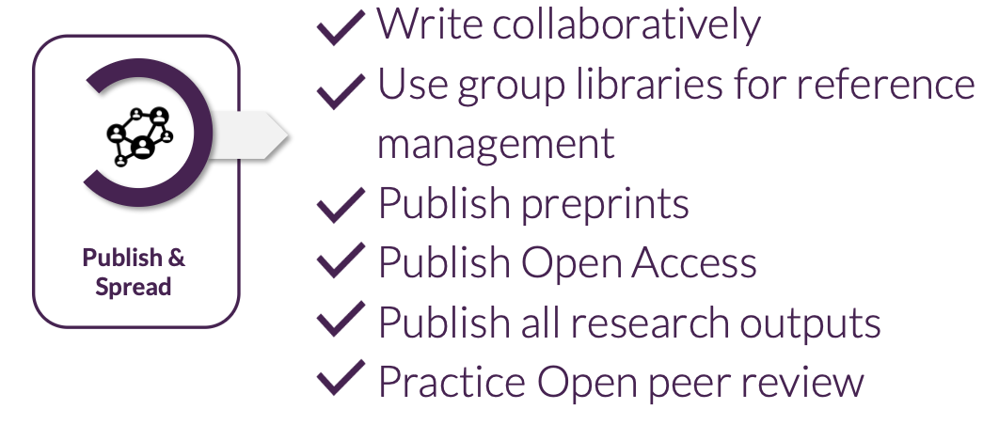

::: {.callout-tip}
### About
**Purpose:**   
To develop a critical understanding of Open Access publishing in the Swedish context, including the range of publishing models available, how to evaluate them, and the emerging practice of open peer review.

**Learning outcomes:**   
Upon completion of this assignment, participants will be able to:

- Evaluate different Open Access models, including their benefits,limitations, and ethical implications
- Explain the principles of open peer review and reflect on its implications for research transparency and evaluation

**Duration:**   
90min

**To-do:**   
Before this session, complete [assignment 3](Assignment3.qmd)

:::

## 3.1 Presentation

Here you can find the presentation for this session:

<iframe src="https://docs.google.com/presentation/d/e/2PACX-1vQwQdrizwVGpwKqMk7FMPBxXtR6zKqlREjxYlbmvxbHOyBaiyv46QNUbacWTXpytg/pubembed?start=false&loop=false&delayms=3000" frameborder="0" width="640" height="389" allowfullscreen="true" mozallowfullscreen="true" webkitallowfullscreen="true"></iframe>

  <strong>Reuse:</strong> 
    <a href="https://docs.google.com/presentation/d/1gFvfrV_8_WA2qlf0tkFSUH7nVXPzga4z/view" target="_blank">View in Google Slides</a> | 
    <a href="https://docs.google.com/presentation/d/1gFvfrV_8_WA2qlf0tkFSUH7nVXPzga4z/copy" target="_blank">Make a Copy</a> 

## 3.2 Introduction

This session focuses on the **Publish and spread** stage of the Open Science workflow, with a specific focus on Open Access publishing. **Open Access is about ensuring that the results of your research can be read, used, and built upon by anyone**, not just those with access to expensive journal subscriptions. The goal is not simply compliance with funder requirements, but making your work as discoverable and impactful as possible.

The session is structured as a mix of discussion and group work. Rather than presenting Open Access as a single straightforward practice, the session explores the full complexity of the publishing landscape as it exists today: the different models available to you, how to evaluate them critically, and the trade-offs involved. By the end of the session, you will be better equipped to make informed publishing decisions for your own research.

{ fig-align="left" width="70%"} 

<!--## 3.3 Key session takeaways-->

## References and further reading
(1) The Swedish Research Barometer 2025: Swedish research in international comparison. The Swedish Research Council (Vetenskapsrådet). Accessed from [https://www.vr.se/english/analysis/reports/our-reports/2025-12-18-the-swedish-research-barometer-2025.html](https://www.vr.se/english/analysis/reports/our-reports/2025-12-18-the-swedish-research-barometer-2025.html) 
(2) ESAC Market Watch. 2023. Accessed from [https://esac-initiative.org/market-watch/](https://esac-initiative.org/market-watch/)  
(3) Smith M, Anderson I, Bjork B, McCabe M, Solomon D, Tananbaum, G, et al. (2016). [Final Report]. UC Office of the President: University of California Systemwide Libraries. Retrieved from [https://escholarship.org/uc/item/8326n305](https://escholarship.org/uc/item/8326n305)
(4) Open Peer Review case sutdy: Gosselin, O, Taschner M, Huber-Hürlimann LM, Seeger MA, Gruber S. 2025. Single Domain Antibody Inhibitors Target the Coiled Coil Arms of the Bacillus subtilis SMC complex. bioRxiv 2025.10.16.682983; doi: [https://doi.org/10.1101/2025.10.16.682983](https://doi.org/10.1101/2025.10.16.682983)
(5) Open Peer Review case study:  Asaduzzaman M, Oláh P, Yaseen NJ, Taifi A, Járay T,Gulyás G, Boldogkői Z, Tombácz D. 2026.Longitudinal long-read microbiome profiling in a canine model reveals how age, diet, and birth mode shape gut community dynamics. mSystems11:e01279-25. [https://doi.org/10.1128/msystems.01279-25](https://doi.org/10.1128/msystems.01279-25)

## Reuse
### Contributors

- Kristen Schroeder 

### License  

All materials from this session are available for re-use under 

### Please cite material as:   
   
> Kristen Schroeder (2026) *Open Science in the Swedish context, DDLS Research school. Session 3: OS in project sharing & publishing*. Retrieved from https://scilifelab-training.github.io/open-science/2603/Session3.html   

