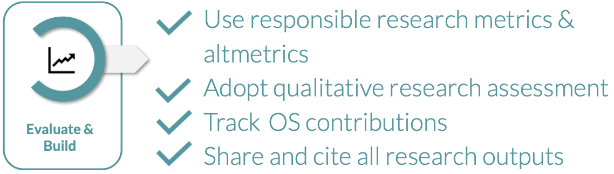

::: {.callout-tip}
### About
**Purpose:**   
To develop an understanding of how research and researchers are evaluated in a changing academic landscape, and how Open Science practices like the publication of diverse research outputs and FAIR data increasingly shape recognition and career development.

**Learning outcomes:**   
Upon completion of this assignment, participants will be able to:

- Identify emerging researcher evaluation criteria and demonstrate an understanding of which research outputs can be published and credited
- Understand the range of research contribution criteria used in modern research assessment
- Be aware of the Coalition for Advancing Research Assessment (CoARA) and its implications for academic careers
- Have a basic understanding of how to make research data FAIR and explain the 
importance of metadata in making outputs findable and reusable

**Duration:**   
90min

:::

## 4.1 Presentation

Here you can find the presentation for this session:

<iframe src="https://docs.google.com/presentation/d/e/2PACX-1vQGPTC7Zki6ozFzX_bdQINm3a-7i1I0aCWpqFNs5vj3Zx9jhAzfhaTIhLLhFW6uEYPdQhd2os_lys8i/pubembed?start=false&loop=false&delayms=3000" frameborder="0" width="640" height="389" allowfullscreen="true" mozallowfullscreen="true" webkitallowfullscreen="true"></iframe>

  <strong>Reuse:</strong> 
    <a href="https://docs.google.com/presentation/d/1mTjJWkWyg7qbLUBxmDISSOlqMptksIlcQZLSaHX61d0/view" target="_blank">View in Google Slides</a> | 
    <a href="https://docs.google.com/presentation/d/1mTjJWkWyg7qbLUBxmDISSOlqMptksIlcQZLSaHX61d0/copy" target="_blank">Make a Copy</a> 

## 4.2 Introduction

This session focuses on the final stage of the Open Science workflow: **Evaluate & build**. 
  
{ fig-align="left" width="70%"} 

## Reuse
### Contributors

- Joanna Sendecka 

### License  

All materials from this session are available for re-use under 

### Please cite material as:   
   
> Joanna Sendecka (2026) *Open Science in the Swedish context, DDLS Research school. Session 4: OS in researcher evaluation*. Retrieved from https://scilifelab-training.github.io/open-science/2603/Session2.html   

