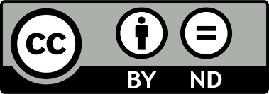

::: {.callout-tip}
### Learning Objectives

By the end of this session, learners will be able to:

- Summarize the role of CoARA in re-shaping researcher evaluation 
- Identify future evaluation criteria for researchers and the importance of sharing all research outputs  

:::
## Schedule  

<table style="border-collapse: collapse; width: 100%;">
  <tr style="border-bottom: 0.5px solid #808080;">
    <th style="width: 15%;">Time</th>
    <th style="width: 60%;">Topic</th>
    <th style="width: 25%;">Instructor</th>
    </tr>
  </thead>
  <tbody>
    <tr style="border-bottom: 0.4px solid #D3D3D3;">
      <td style="padding: 10px 0;">13:00</td>  
      <td style="padding: 10px 0;">Open Science in researcher evaluation practices</td>
      <td style="padding: 10px 0;">Ineke Luijten</td>
    </tr>
    <tr style="border-bottom: 0.4px solid #D3D3D3;">
      <td style="padding: 10px 0;">13:30</td>
      <td style="padding: 10px 0;">Innovations in researcher evaluation - CoARA</td>
      <td style="padding: 10px 0;">Chris Erdmann</td>
    </tr>
    <tr style="border-bottom: 0.4px solid #D3D3D3;">
      <td style="padding: 10px 0;">14:30</td>
      <td style="padding: 10px 0;">Coffee break</td>
      <td style="padding: 10px 0;"></td>
    </tr>
    <tr style="border-bottom: 0.4px solid #D3D3D3;">
      <td style="padding: 10px 0;">15:00</td>
      <td style="padding: 10px 0;">Researcher evaluation: funders perspective</td>
      <td style="padding: 10px 0;">Sanna Isabel Ulfsparre & Amanda Klein</td>
    </tr>
    <tr style="border-bottom:0.5px solid #808080;">
      <td style="padding: 10px 0;">16:30</td>
      <td style="padding: 10px 0;">End of day</td>
      <td style="padding: 10px 0;"></td>
    </tr>
  </tbody>
</table>
  

## Materials    

**Open Science in researcher evaluation practices**

<iframe src="https://docs.google.com/presentation/d/e/2PACX-1vRQ4gwTWwtOYJHG2B6IC2URkS7A-CW_18Pedp_WnzjMblV8a7WIb6rDxfSnyZzZ7XGedTZF6S1WK1or/pubembed?start=false&loop=false&delayms=3000" frameborder="0" width="700" height="420"></iframe>  
  

  ➡️ <a href="https://docs.google.com/presentation/d/1-V5yR4bytTM2WmU4UXc2CEDyTYYUaaU9jla8_hACABc/view" target="_blank">Open this presentation in Google Slides (for viewing)</a> 
  ➡️ <a href="https://docs.google.com/presentation/d/1-V5yR4bytTM2WmU4UXc2CEDyTYYUaaU9jla8_hACABc/copy" target="_blank">Make a copy of this presentation (for editing or downloading)</a>

  
  
**Innovations in researcher evaluation - CoARA**  
  
<iframe src="https://docs.google.com/presentation/d/e/2PACX-1vQfiMahsrMcCvhFT9po8jUbiEZigJh3e_t7zBKCQlejPvZBAzADJlBOmh87AxPQi03YlKFt5CLn-u7Q/pubembed?start=false&loop=false&delayms=3000" frameborder="0" width="700" height="420"></iframe>     
   

  ➡️ <a href="https://docs.google.com/presentation/d/1R-z0uZHtSu_b-LnWjar_OPpsTENS6-oXeXWk05t7mdU/view" target="_blank">Open this presentation in Google Slides (for viewing)</a> 
  ➡️ <a href="https://docs.google.com/presentation/d/1R-z0uZHtSu_b-LnWjar_OPpsTENS6-oXeXWk05t7mdU/copy" target="_blank">Make a copy of this presentation (for editing or downloading)</a>

 
  
**Researcher evaluation: funders perspective**  
  
<iframe src="https://drive.google.com/file/d/1Tc-nrHZuO-GgluDuF1jepFISUVzyyotH/preview" width="700" height="420" allow="autoplay"></iframe>   
 ➡️ <a href="https://docs.google.com/document/d/1JKbWOXYXQl-0YqUmgRCKuCwVWxp2fEEjfHNxhvl6nzU/edit?usp=sharing" target="_blank">Open speaker notes for this presentation in Google Docs (view-only)</a>   

## Contributors

- Ineke Luijten 
- Chris Erdmann  
- Sanna Isabel Ulfsparre 
- Amanda Klein 

## Reuse  

All SciLifeLab materials from this session are available for re-use under . You are free to share (copy and redistribute) and adapt (remix, transform, and build upon) this material for any purpose, even commercially — as long as you give appropriate credit to the original authors.  
All Vetenskapsrådet materials from this session are available for re-use under . You are free to share (copy and redistribute) this material for any purpose, even commercially — as long as you give appropriate credit to the original authors and do not adapt (remix, transform, or build upon) the material.  

Please cite material as:   
   
> Ineke Luijten, Chris Erdmann, Sanna Isabel Ulfsparre, Amanda Klein (2025) *Open Science in the Swedish context - Open Science in the project lifecycle - evaluate & build*. Retrieved from https://scilifelab-training.github.io/open-science/2505/Session6.html   

