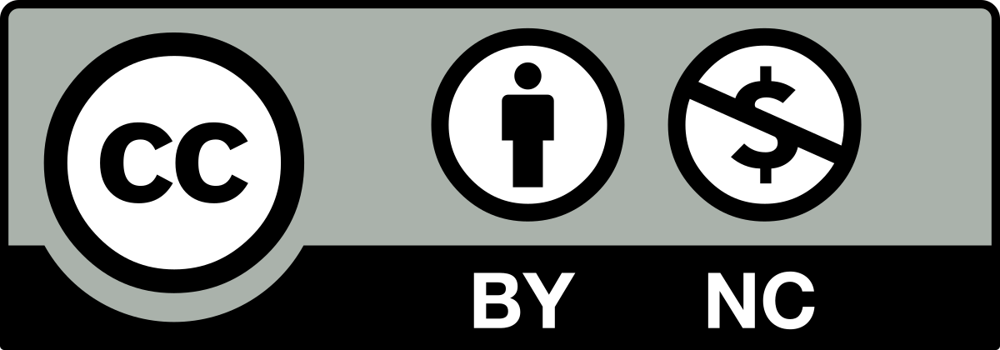

## Learning Outcomes

Upon completion of this module, students will be able to:

- Recognize how the research workflow can be opened to benefit society  
- Identify opportunities for public outreach and science communication in Sweden  

## Schedule  

<table style="border-collapse: collapse; width: 100%;">
  <tr style="border-bottom: 0.5px solid #808080;">
    <th style="width: 15%;">Time</th>
    <th style="width: 60%;">Topic</th>
    <th style="width: 25%;">Instructor</th>
    </tr>
  </thead>
  <tbody>
    <tr style="border-bottom: 0.4px solid #D3D3D3;">
      <td style="padding: 10px 0;">09:00</td>  
      <td style="padding: 10px 0;">Science Communication</td>
      <td style="padding: 10px 0;">Karin Westin Tikkanen</td>
    </tr>
    <tr style="border-bottom: 0.4px solid #D3D3D3;">
      <td style="padding: 10px 0;">10:15</td>
      <td style="padding: 10px 0;">Coffee break</td>
      <td style="padding: 10px 0;"></td>
    </tr>
    <tr style="border-bottom: 0.4px solid #D3D3D3;">
      <td style="padding: 10px 0;">10:45</td>
      <td style="padding: 10px 0;">Citizen science in Sweden</td>
      <td style="padding: 10px 0;">Lotta Waesterberg Tomasson</td>
    </tr>
    <tr style="border-bottom: 0.5px solid #808080;">
      <td style="padding: 10px 0;">12:00</td>
      <td style="padding: 10px 0;">Lunch</td>
      <td style="padding: 10px 0;"></td>
    </tr>
  </tbody>
</table>
  

## Materials & Reuse 

**Open Science in science communication & public involvement**

<iframe src="https://docs.google.com/presentation/d/e/2PACX-1vSqs6nvSTzF-i6HtPaQ4u3zCzal9G_5ppnB2Q2ujeWjb6W7i_o03U3d6-B5EwSwPJ4ivSvR33g_gG_Z/pubembed?start=false&loop=false&delayms=3000" frameborder="0" width="700" height="420"></iframe>    

  <strong>Author(s):</strong> Ineke Luijten  
  <strong>License:</strong> [CC BY 4.0](https://creativecommons.org/licenses/by/4.0/)  
  <strong>DOI:</strong> <a href="https://doi.org/10.17044/scilifelab.29365787.v1">https://doi.org/10.17044/scilifelab.29365787.v1</a> 
  <strong>Citation:</strong> Luijten, I. (2025). *Open Science in the Swedish context - Open Science in science communication & public involvement*. SciLifeLab Training Hub. DOI: 10.17044/scilifelab.29365787.v1 
  <strong>Download:</strong> 
    <a href="https://docs.google.com/presentation/d/1hD9_3dmnv3eZ-ab2yQizEhLMJI7rei7rhqvdRVFOct4/view" target="_blank">View in Google Slides</a> | 
    <a href="https://docs.google.com/presentation/d/1hD9_3dmnv3eZ-ab2yQizEhLMJI7rei7rhqvdRVFOct4/copy" target="_blank">Make a Copy</a> 

  
    
    

    
**Science communication**
  
<iframe src="https://docs.google.com/presentation/d/e/2PACX-1vRyZBBeiQxKSrgaFKEBzwG0Lt6mp_sUmD5LjVs68qwaSQGOyz03QyBZ4MYiygrurQ/pubembed?start=false&loop=false&delayms=3000" frameborder="0" width="700" height="420"></iframe>  

  <strong>Author(s):</strong> Karin Westin Tikkanen  
  <strong>License:</strong> [CC BY 4.0](https://creativecommons.org/licenses/by/4.0/)  
  <strong>DOI:</strong> <a href="https://doi.org/10.17044/scilifelab.29365787.v1">https://doi.org/10.17044/scilifelab.29365787.v1</a> 
  <strong>Citation:</strong> Westin Tikkanen, K. (2025). *Open Science in the Swedish context - Science communication*. SND. DOI: 10.17044/scilifelab.29365787.v1 
  <strong>Download:</strong> 
    <a href="https://docs.google.com/presentation/d/19DJUlO147EJpOZ_6FhXbI0v1gj1dzIKD/view" target="_blank">View in Google Slides</a> | 
    <a href="https://docs.google.com/presentation/d/19DJUlO147EJpOZ_6FhXbI0v1gj1dzIKD/copy" target="_blank">Make a Copy</a> 

  
    
    

**Citizen science**
  
<iframe src="https://docs.google.com/presentation/d/e/2PACX-1vQyXQ-i7-xBbGFeXhNrXeyEITJ4fli_-ZOf2w7dGByKnc68opBCjA3XllJGV2rBgg/pubembed?start=false&loop=false&delayms=3000" frameborder="0" width="700" height="420"></iframe>  

  <strong>Author(s):</strong> Lotta Waesterberg Tomasson  
  <strong>License:</strong> [CC BY-NC 4.0](https://creativecommons.org/licenses/by-nc/4.0/deed.en)  
  <strong>DOI:</strong> <a href="https://doi.org/10.17044/scilifelab.29365787.v1">https://doi.org/10.17044/scilifelab.29365787.v1</a> 
  <strong>Citation:</strong> Waesterberg Tomasson, L. (2025). *Open Science in the Swedish context - Citizen Science in Sweden*. Vetenskap & Allmänhet. DOI: 10.17044/scilifelab.29365787.v1 
  <strong>Download:</strong> 
    <a href="https://docs.google.com/presentation/d/1DjzzlhNTO4vZFGXutcgGRglOhuFG0nLg/view" target="_blank">View in Google Slides</a> | 
    <a href="https://docs.google.com/presentation/d/1DjzzlhNTO4vZFGXutcgGRglOhuFG0nLg/copy" target="_blank">Make a Copy</a> 

  
    
  
   

## License details   
 You are free to share (copy and redistribute) and adapt (remix, transform, and build upon) this material for any purpose, even commercially — as long as you give appropriate credit to the original authors.       
. You are free to share (copy and redistribute) this material for any non-commercial purpose — as long as you give appropriate credit to the original authors and do not use the material for commercial purposes.    
    

