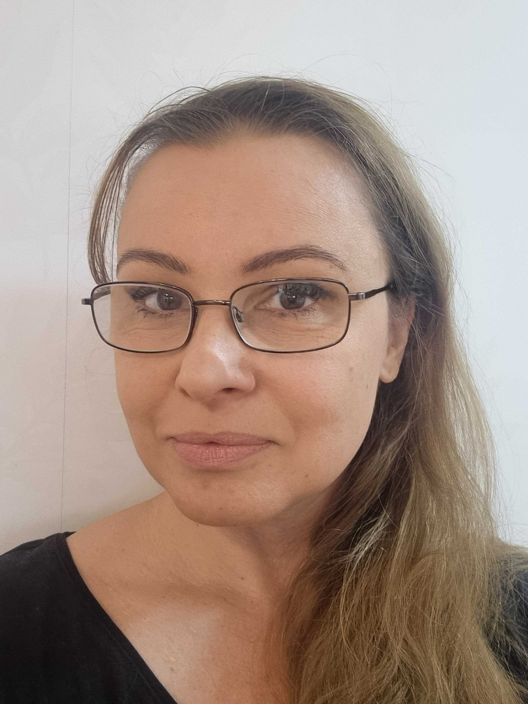

 

## Course syllabus

 <strong>Description</strong> 
The 1hp course ‘Open Science in the Swedish Context’ is designed to teach DDLS research school scientists how to apply Swedish Open Science standards in their daily research. The course covers key stages of the research lifecycle, from planning a research project, to sharing results, to science communication and researcher evaluation. Through interactive lectures, guest speakers, and practical assignments, participants will explore pre-registration, Open Access publishing, up-and-coming researcher evaluation criteria, and citizen science. Completing this training will prepare DDLS students to lead the global shift toward open and collaborative research.

 <strong>Prerequisites</strong> 
To follow this course, learners should have basic knowledge of: 
1. Principles of scientific research and methodology 
2. How research outputs are typically disseminated, (e.g., journals, conferences etc.) 
3. The structure of the Swedish research system, including universities and funding bodies

 <strong>Learning Outcomes</strong> 
1. Get acquainted with Open Science principles and how they will be implemented into Swedish academia within the coming years 
2. Develop a foundational understanding of how to apply Open Science principles at key stages of a research project 

 <strong>Target Audience:</strong> Researchers in the SciLifeLab DDLS program

 <strong>Level:</strong> Beginner

 <strong>License:</strong>
<a href="https://creativecommons.org/licenses/by/4.0/">CC BY 4.0</a>

::: {.callout-warning title="Course certificate"}
To receive a course certificate, please complete all assignments, attend the in-person workshop, and email ineke.luijten@scilifelab.se

:::

## Course lead

<!-- Blank line above -->

  

    
    

      <h4 class="leader-name">Ineke Luijten</h4>
      

        
        
        
      

      
Scientific Training Officer, SciLifeLab Training Hub

    

  

 

## Contributors

<!-- Blank line above -->

  

    
    

      <h4 class="leader-name">Kristen Schroeder</h4>
      

        
        
        
      

      
Scientific Training Officer, SciLifeLab Training Hub

    

  

  

    
    

      <h4 class="leader-name">Joanna Sendecka</h4>
      

        
        
      

      
Data Stewards, SciLifeLab Data Centre

    

  

 
